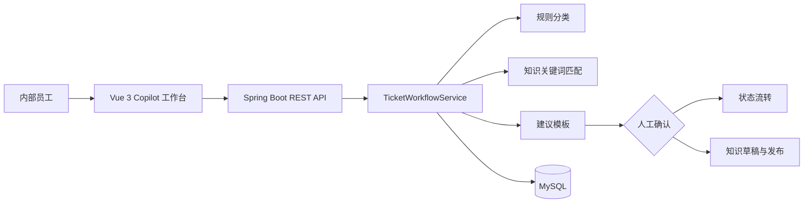
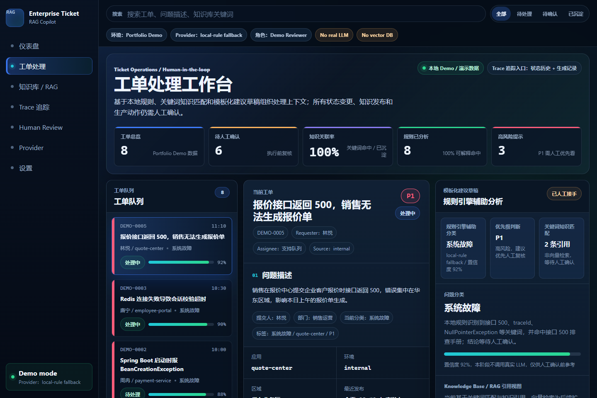
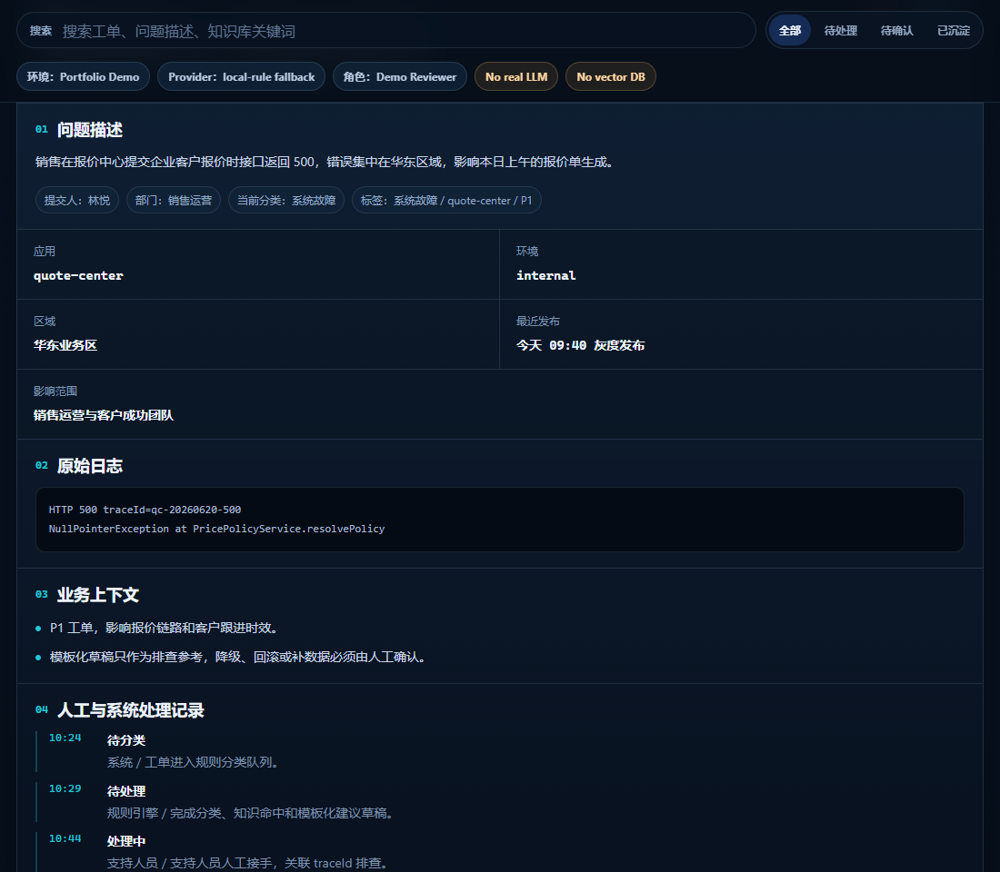
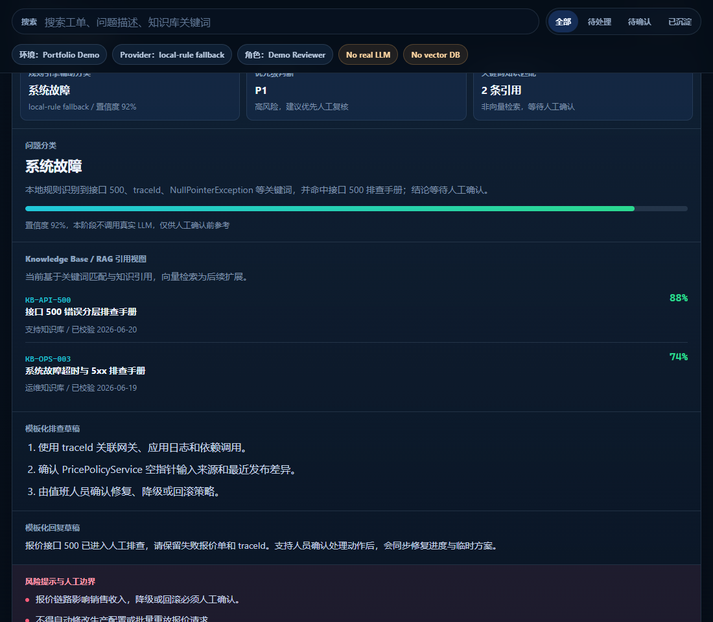
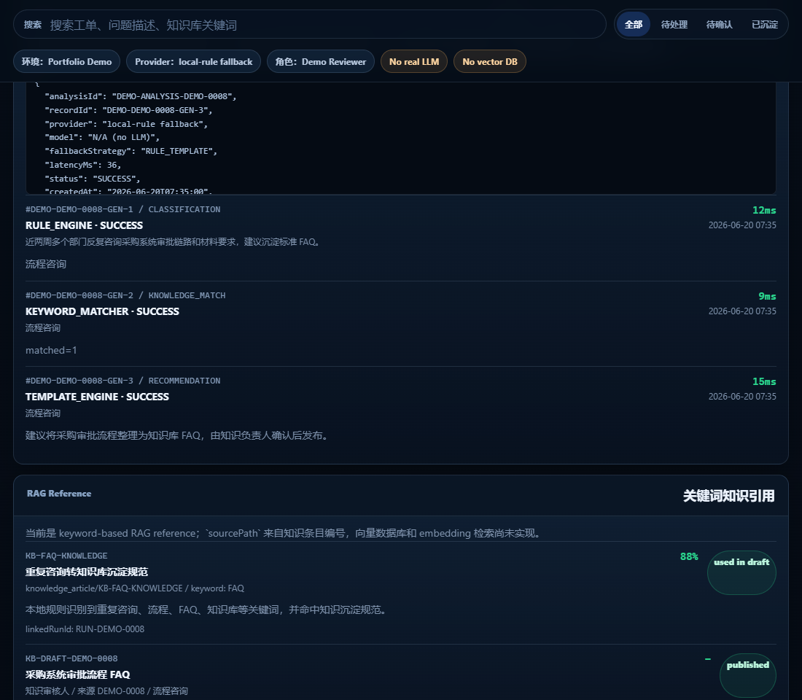
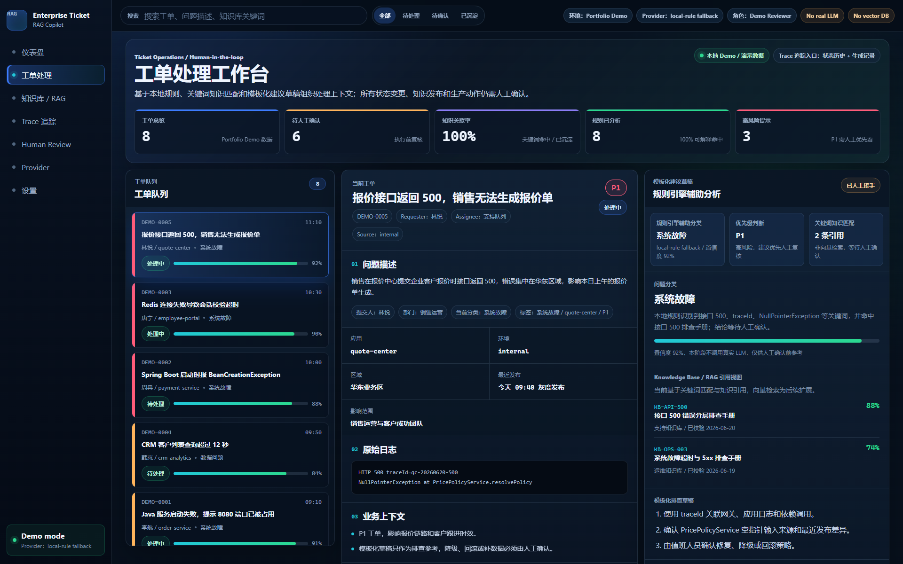

# Enterprise AI Ticket Copilot

企业内部工单辅助处理与知识库工作台，是一个面向内部支持团队的个人作品集 / 实习简历项目。它围绕“工单进入 -> 规则引擎辅助分类 -> 知识库评分匹配 -> 模板化建议草稿 -> 人工确认 -> 状态流转 -> 知识沉淀”组织可演示闭环。

项目名保留 Copilot，是指面向客服 / 运维人员的辅助处理工作台，不代表接入真实大模型。当前仓库用于本地开发和作品展示，不是生产系统，不包含真实客户数据，也没有真实 LLM 调用、模型训练、embedding 或向量检索。系统只提供规则分类、知识匹配和模板化建议草稿，状态变更和知识发布仍由人工最终确认。

## 项目简介

项目将工单队列、工单详情、规则分析、知识命中、模板化建议草稿、人工确认和状态历史整合到同一个 Copilot 工作台。前端提供可独立运行的 Demo 模式；后端提供基于 Spring Boot、MyBatis-Plus 和 MySQL 的本地数据闭环。

## 技术栈

- 前端：Vue 3、TypeScript、Vite、原生 CSS Design Tokens
- 后端：Java 17、Spring Boot 3、MyBatis-Plus、Maven
- 数据库：MySQL 8
- 演示与验收：本地 Demo/Mock 数据、Playwright Core 截图脚本

## 核心功能

- 工单录入与队列：提交问题描述、系统信息、错误日志和优先级，并按关键词与状态筛选。
- 规则引擎辅助分类：根据标题、描述、系统和错误日志中的关键词生成问题分类、置信度、原因和风险提示。
- 知识匹配：根据工单内容、分类和关键词评分返回已有知识条目命中结果。
- 模板化建议草稿：整理排查步骤、回复建议和下一步动作，明确标记为待人工确认。
- 状态流转：记录待分类、待处理、处理中、已解决、已沉淀等状态变化。
- 知识沉淀：从已解决工单生成知识草稿，经人工确认后再进入知识库记录。
- 过程留痕：展示状态历史与建议生成记录，便于演示人机协作边界。

> 当前实现是规则驱动的本地演示闭环，不等同于完整 RAG 平台，也不代表系统可自动处理全部工单。

## 架构与核心流程



完整架构、状态机和知识沉淀流程见 [docs/architecture.md](docs/architecture.md)。

## 页面截图

以下截图由仓库内 Playwright 脚本从真实 Vue 前端页面生成，页面内容使用本地 Demo/Mock 数据，不包含真实企业或客户信息。

主控制台：



<table>
<tr>
<td width="50%">

<br />
工单详情与处理上下文
</td>
<td width="50%">

<br />
规则引擎辅助分析与模板化建议草稿
</td>
</tr>
<tr>
<td width="50%">

<br />
知识库评分匹配与人工确认
</td>
<td width="50%">

<br />
大尺寸控制台截图
</td>
</tr>
</table>

`docs/images/large/` 保存对应的 `1920x1200` 大屏版本，适合演示或作品集排版。

## 快速启动

### 本地运行前置条件

- Java 17
- Maven 3.9+（或兼容版本）
- MySQL 8.x 或兼容版本
- Node.js / npm（运行前端时需要）

### 前端 Demo 模式

无需启动后端或 MySQL，即可使用本地 Demo/Mock 数据体验完整界面：

```bash
cd frontend
npm install
npm run dev:demo
```

默认访问：`http://localhost:5173`

### 本地 MySQL 闭环

当前后端使用规则引擎辅助分类、关键词知识匹配和模板化建议草稿，不依赖真实 LLM API。MySQL 闭环用于验证后端 REST API、表结构、演示数据和前端真实接口调用。

1. 创建数据库：

```sql
CREATE DATABASE enterprise_ai_ticket_copilot DEFAULT CHARACTER SET utf8mb4 COLLATE utf8mb4_unicode_ci;
```

仓库 SQL 当前使用 `enterprise_ai_ticket_copilot`，请保持数据库名与 `backend/src/main/resources/schema.sql`、`backend/src/main/resources/demo-data.sql` 一致。

2. 导入表结构和演示数据：

```bash
mysql -uroot -p < backend/src/main/resources/schema.sql
mysql -uroot -p enterprise_ai_ticket_copilot < backend/src/main/resources/demo-data.sql
```

`schema.sql` 会创建 5 张业务表并写入基础知识库数据；`demo-data.sql` 会写入 DEMO 工单、规则分析记录、状态历史和建议生成记录。

3. 复制示例配置并修改本地数据库账号：

```powershell
Copy-Item backend/src/main/resources/application-example.yml backend/src/main/resources/application-local.yml
```

macOS / Linux 可使用：

```bash
cp backend/src/main/resources/application-example.yml backend/src/main/resources/application-local.yml
```

打开 `backend/src/main/resources/application-local.yml`，把 `your_username` 和 `your_password` 改成你本机 MySQL 用户名和密码。`application-local.yml` 已加入 `.gitignore`，不得提交真实本地密码。

4. 启动后端：

```bash
cd backend
mvn spring-boot:run -Dspring-boot.run.profiles=local
```

5. 验证后端接口：

```bash
curl http://localhost:8080/api/health
curl http://localhost:8080/api/tickets
```

`/api/health` 应返回 200；`/api/tickets` 应能看到 DEMO 工单列表。

6. 启动前端真实后端模式：

```bash
cd frontend
npm install
npm run dev
```

后端默认地址为 `http://localhost:8080`，前端默认地址为 `http://localhost:5173`。如果只想看界面演示，可以继续使用 `npm run dev:demo`，该模式不依赖后端或 MySQL。

## API 概览

| 方法 | 路径 | 用途 |
| --- | --- | --- |
| `GET` | `/api/health` | 健康检查 |
| `GET` | `/api/tickets` | 查询工单队列 |
| `POST` | `/api/tickets` | 创建工单并生成规则建议 |
| `GET` | `/api/tickets/metrics` | 查询工作台指标 |
| `GET` | `/api/tickets/{id}` | 查询工单详情与状态历史 |
| `GET` | `/api/tickets/{id}/ai-analysis` | 查询规则分类、知识命中和建议草稿 |
| `GET` | `/api/tickets/{id}/trace-evidence` | 查询工单 Trace、生成记录、RAG 引用和 Human Review 证据链 |
| `POST` | `/api/tickets/{id}/status` | 人工确认状态流转 |
| `POST` | `/api/tickets/{id}/knowledge-draft` | 为已解决工单生成知识草稿 |
| `POST` | `/api/tickets/knowledge/{articleNo}/confirm` | 人工确认并发布知识草稿 |

后端启动后可访问 Swagger UI：[http://localhost:8080/swagger-ui/index.html](http://localhost:8080/swagger-ui/index.html)

OpenAPI JSON：[http://localhost:8080/v3/api-docs](http://localhost:8080/v3/api-docs)

人工整理版接口文档详见 [docs/API.md](docs/API.md)；后端启动后也可以访问 Swagger UI。

Swagger 仅用于查看 REST API 文档，不代表项目接入真实 LLM。

## Demo 模式说明

- `npm run dev:demo` 使用前端内置的本地 Demo/Mock 工单，不依赖后端和数据库。
- Demo 数据仅用于展示分类、知识匹配、人工确认、状态流转和知识沉淀交互；刷新页面后内存修改会重置。
- 搜索会真实匹配工单标题、问题描述、错误日志和知识条目关键词，状态筛选也会实际改变队列结果。
- `npm run screenshots` 会启动 Demo 页面，通过真实浏览器生成 README 截图，并验证搜索、筛选、知识沉淀交互及 1366/390 宽度无横向溢出。
- Demo 中出现的团队、系统、日志和工单均为演示内容，不对应真实企业客户。

## 测试与验收结果

2026-06-21 本地验收结果：

| 检查项 | 结果 | 说明 |
| --- | --- | --- |
| `npm install` | 通过 | 依赖安装完成，审计结果为 0 个漏洞 |
| `npm run typecheck` | 通过 | Vue SFC 与 TypeScript 类型检查完成 |
| `npm run build` | 通过 | 类型检查与 Vite 生产构建完成 |
| `npm run screenshots` | 通过 | 生成 8 张截图，并完成 Demo 交互与响应式断言 |
| `mvn -v` | 通过 | Maven 3.9.11、Java 17 可用 |
| `mvn test` | 通过 | 21 项 Controller/Service/H2 集成测试全部通过；不宣称完整生产测试覆盖 |

测试证据详见 [docs/TEST_REPORT.md](docs/TEST_REPORT.md)。

本项目已新增 GitHub Actions CI workflow：[.github/workflows/ci.yml](.github/workflows/ci.yml)。CI 会在 `push` 和 `pull_request` 时自动运行后端 `mvn test` 与前端 `npm run build`；本轮已通过 GitHub CLI 确认远端 `backend-tests` 和 `frontend-build` 两个 job 均成功，后续提交仍以 GitHub Actions 页面结果为准。

## 项目边界

- 这是个人作品集 / 实习简历项目，不是已上线的生产系统。
- 仓库与截图不包含真实客户数据，演示数据均为本地构造。
- 当前分析结果由规则引擎、关键词评分和模板驱动，不承诺真实大模型稳定接入。
- 当前知识匹配与沉淀用于展示业务闭环，不宣称为完整 RAG 知识库系统。
- Trace Evidence 中的 `runId` / `traceId` 是基于工单记录派生的展示标识，不代表完整分布式 Trace / Span Runtime。
- 系统只生成建议草稿；工单状态变更、对外回复和知识发布需要人工确认。
- Stitch Design Taste 仅作为本轮界面视觉设计参考，不属于项目业务功能或商业 UI 资产。

## 后续可扩展方向

- 在保留人工确认边界的前提下，评估企业私有模型或受控检索增强。
- 增加鉴权、角色权限、审计日志和数据库集成测试。
- 为真实部署补充可观测性、数据脱敏、限流和灾备方案。

这些方向目前均未实现，不属于仓库现有能力。

## 简历亮点

- 从工单录入到知识沉淀，设计并实现了具备人工确认边界的企业工单辅助处理闭环。
- 使用 Vue 3 + TypeScript 构建轻量企业 Copilot 工作台，并用 Playwright 固化真实页面截图验收。
- 使用 Spring Boot + MyBatis-Plus + MySQL 组织工单、状态历史、建议记录与知识草稿的数据关系。
- 使用 Bean Validation、全局异常处理、幂等发布保护和 17 项自动化测试验证关键业务边界。
- 在 README 中明确区分 Demo、规则能力、真实大模型与生产边界，避免将演示能力包装为生产能力。

## 项目文档

- [产品设计](docs/product-design.md)
- [接口文档](docs/API.md)
- [Trace Evidence 说明](docs/trace-evidence.md)
- [前端风格规范](docs/frontend-style.md)
- [架构说明](docs/architecture.md)
- [演示脚本](docs/demo-script.md)
- [面试讲解指南](docs/interview-guide.md)
- [验收清单](docs/acceptance-checklist.md)
