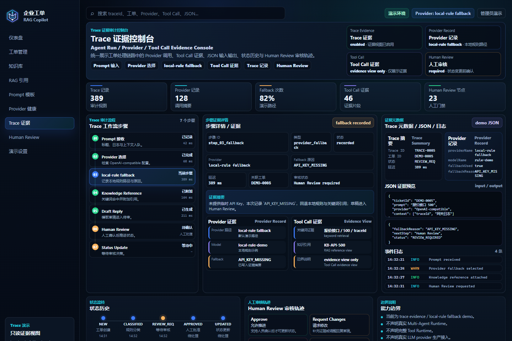
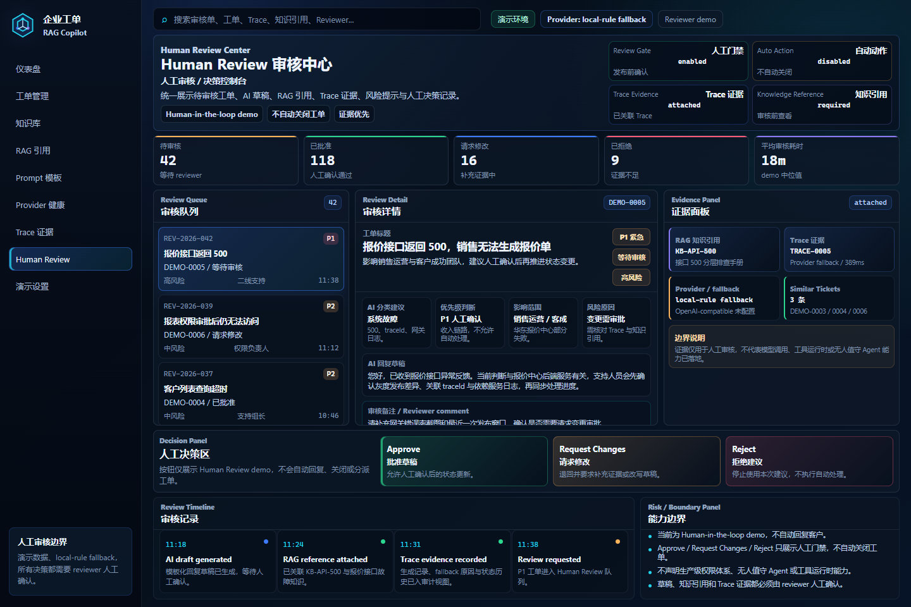

# Enterprise AI Ticket RAG Copilot

Portfolio Case Study: [https://ai-agent-portfolio-hub.vercel.app/projects/ticket-rag](https://ai-agent-portfolio-hub.vercel.app/projects/ticket-rag)

面向企业客服与内部 IT 工单场景的 AI Copilot 作品集项目，展示工单分析、RAG 知识引用、Trace Evidence、Provider fallback 与 Human Review 人工审核闭环。

当前项目默认使用 `local-rule fallback`：分类来自本地规则，知识检索来自关键词匹配，回复内容是模板化建议草稿。5 个 Showcase 页面使用本地 Demo 数据，重点呈现产品交互和工程边界，不代表已部署生产级自动客服或无人值守 Agent。

## Showcase

以下图片由仓库内 `npm run screenshots` 使用真实浏览器从 Vue Showcase 页面生成，不包含真实企业或客户数据。点击图片可查看 `1920x1200` 大图。

### Dashboard — 企业级 Copilot 总览

<a href="docs/images/large/dashboard.png">
  
</a>

<table>
<tr>
<td width="50%" valign="top">
<strong>Ticket Workbench — 工单上下文与处理工作台</strong><br /><br />
<a href="docs/images/large/ticket-detail.png">
  
</a>
</td>
<td width="50%" valign="top">
<strong>Knowledge / RAG — 知识引用与证据链</strong><br /><br />
<a href="docs/images/large/knowledge-base.png">
  
</a>
</td>
</tr>
<tr>
<td width="50%" valign="top">
<strong>Trace Evidence — Provider、fallback 与 JSON 证据</strong><br /><br />
<a href="docs/images/large/trace-evidence.png">
  
</a>
</td>
<td width="50%" valign="top">
<strong>Human Review — 人工审核决策控制台</strong><br /><br />
<a href="docs/images/large/human-review.png">
  
</a>
</td>
</tr>
</table>

`docs/images/large/` 保存 5 个页面对应的 `1920x1200` 大图，适合作品集排版或面试展示。

## 核心能力

- **多页面企业工作台**：统一展示 Dashboard、Ticket Workbench、Knowledge / RAG、Trace Evidence 与 Human Review。
- **工单辅助分析**：根据标题、描述、系统名和错误日志执行本地规则分类与优先级建议。
- **建议草稿**：默认由规则、知识命中和模板生成排查步骤、风险提示与回复草稿，提交前需要人工确认。
- **RAG Reference 展示**：呈现知识标题、来源路径、关键词命中、相关度和引用片段；当前不是 embedding 或向量检索。
- **Provider fallback**：已实现 OpenAI-compatible `/chat/completions` 可选路径；未配置、超时或调用失败时记录原因并回退到 local-rule。
- **Trace Evidence**：聚合分析记录、`generation_record`、状态历史和知识引用，并展示 Provider、model、latency、fallback 与 JSON 摘要。
- **Human Review 门禁**：提供 Approve、Request Changes、Reject 的 demo 状态闭环，状态流转、回复和知识发布都要求人工确认。
- **可复现展示**：本地 Demo 数据无需外部服务即可运行，截图脚本覆盖 5 个路由和桌面/移动端横向溢出检查。

> Trace 页面中的 Tool Call 仅是 evidence view / demo evidence，用于说明证据位设计；项目没有完整 Tool Runtime，也不代表工具已被自动执行。

## 技术栈

| 层级 | 技术 |
| --- | --- |
| 前端 | Vue 3、TypeScript、Vite、原生 CSS Design Tokens |
| 后端 | Java 17、Spring Boot 3、MyBatis-Plus、Bean Validation、SpringDoc OpenAPI |
| 数据 | MySQL 8；H2 内存库用于自动化测试 |
| 工程 | Maven、JUnit / Spring Boot Test、Playwright Core、GitHub Actions CI |

后端提供工单、Trace Evidence、Provider/fallback、JWT + RBAC demo 和 Human Review 接口。完整接口以 [docs/API.md](docs/API.md) 和本地 Swagger UI 为准，不把 demo 能力描述成生产级业务系统。

## 本地运行

### 前端 Showcase

无需后端或 MySQL，直接使用本地 Demo 数据：

```bash
cd frontend
npm install
npm run dev:demo
```

默认访问 `http://localhost:5173`。可通过 hash 进入 5 个页面：

- `#dashboard`
- `#ticket-detail`
- `#knowledge-base`
- `#trace-evidence`
- `#human-review`

前端验证命令：

```bash
cd frontend
npm run build
npm run screenshots
```

`npm run screenshots` 会重新生成 `docs/images/` 中的已跟踪图片；只需查看项目时不必执行。

### 后端测试

```bash
cd backend
mvn test
```

### 本地 MySQL 闭环

1. 创建数据库：

```sql
CREATE DATABASE enterprise_ai_ticket_copilot DEFAULT CHARACTER SET utf8mb4 COLLATE utf8mb4_unicode_ci;
```

2. 导入表结构和演示数据：

```bash
mysql -uroot -p enterprise_ai_ticket_copilot < backend/src/main/resources/schema.sql
mysql -uroot -p enterprise_ai_ticket_copilot < backend/src/main/resources/demo-data.sql
```

3. 复制本地配置模板并填写自己的 MySQL 账号：

```powershell
Copy-Item backend/src/main/resources/application-example.yml backend/src/main/resources/application-local.yml
```

macOS / Linux：

```bash
cp backend/src/main/resources/application-example.yml backend/src/main/resources/application-local.yml
```

`application-local.yml` 已加入 `.gitignore`，不要提交数据库密码或 API Key。

4. 启动后端和前端：

```bash
cd backend
mvn spring-boot:run -Dspring-boot.run.profiles=local
```

```bash
cd frontend
npm install
npm run dev
```

后端启动后可访问：

- 健康检查：`http://localhost:8080/api/health`
- Swagger UI：`http://localhost:8080/swagger-ui/index.html`

### 可选真实 Provider 调试

项目可以通过现有 OpenAI-compatible 路径调试 OpenAI 或 DeepSeek。仅使用临时环境变量，不要把真实 Key 写入仓库：

```powershell
$env:TICKET_AI_PROVIDER="openai-compatible"
$env:TICKET_AI_BASE_URL="<OpenAI 或 DeepSeek 的 OpenAI-compatible base URL>"
$env:TICKET_AI_MODEL="<model name>"
$env:TICKET_AI_API_KEY="<temporary API key>"
$env:TICKET_AI_FALLBACK_TO_LOCAL="true"
```

具体调用与清理步骤见 [docs/real-provider-verification.md](docs/real-provider-verification.md)。调试时应限制请求次数和 Token 消耗；无论 Provider 是否可用，状态变化和对外回复仍需 Human Review。

## 验证结果

| 验证项 | 最近结果 |
| --- | --- |
| `cd frontend && npm run build` | 通过：Vue 类型检查与 Vite 生产构建完成 |
| `cd frontend && npm run screenshots` | 通过：覆盖 5 个 Showcase 路由及 1366/390 宽度溢出检查 |
| `cd backend && mvn test` | 通过：`Tests run: 24, Failures: 0, Errors: 0, Skipped: 0` |

测试记录见 [docs/TEST_REPORT.md](docs/TEST_REPORT.md)。2026-06-29 的最小 OpenAI 调试已进入 OpenAI-compatible 路径并写入 `AI_PROVIDER` 记录，但调用结果为 `PROVIDER_ERROR` 后回退到 local-rule；因此当前只确认 Provider 路径与 fallback 记录生效，不声明真实模型成功响应已验证。

## 能力边界

- 这是 portfolio / demo showcase，不是生产级客服系统。
- 默认路径是本地规则、关键词知识匹配和模板化建议草稿；没有模型训练。
- OpenAI-compatible Provider 代码路径已实现，但当前没有成功的真实模型响应验证记录。
- 当前没有 embedding、Vector DB 或完整 RAG Pipeline；RAG 表示关键词知识引用与证据展示。
- 当前没有完整 Tool Runtime、Multi-Agent Runtime 或自动规划执行链。
- JWT + RBAC 仅为 demo 级角色门禁，不是生产级账号、权限和审计体系。
- 不自动回复客户，不自动关闭工单，不自动执行授权、回滚、重启或外部系统操作。
- Human Review 是 demo 级人工确认闭环，不是生产级审核任务平台。
- `runId` / `traceId` 是展示标识，不代表完整分布式 Trace / Span Runtime。
- Showcase 使用本地 Demo 常量；截图证明页面可复现，不等同于真实 API 联调或生产运行证据。

## 简历亮点

- 设计并实现企业工单 Copilot 的 Dashboard、Workbench、Knowledge / RAG、Trace Evidence、Human Review 五页面展示闭环。
- 使用 Spring Boot、MyBatis-Plus 和 MySQL 构建工单状态流转、知识沉淀、生成记录与证据聚合接口。
- 通过 local-rule fallback 保证无外部模型时仍可演示，并记录 Provider、model、latency 和 fallbackReason。
- 通过 Trace Evidence 与 Human Review 将建议来源、风险边界和人工决策放进同一条可解释链路。
- 使用 H2 集成测试、GitHub Actions、前端构建和截图脚本提供可复现验证证据。
- 主动维护 AI 能力边界，避免把关键词检索、demo RBAC 或证据视图包装成生产级 Agent 系统。

## 面试讲解口径

这个项目的重点不是“做了一个真正无人值守、自动处理工单的 Agent”，而是把企业 AI Copilot 应具备的可解释、可审核、可追踪边界做成了可复现的演示作品：规则和知识引用负责提供依据，Provider/fallback 记录负责说明生成路径，Trace Evidence 负责组织证据，Human Review 负责保留最终决策权。

延伸材料：

- [架构与状态流转](docs/architecture.md)
- [REST API 文档](docs/API.md)
- [Trace Evidence 字段与边界](docs/trace-evidence.md)
- [JWT + RBAC Demo](docs/auth-rbac-demo.md)
- [测试执行报告](docs/TEST_REPORT.md)
- [简历证据说明](docs/resume-evidence.md)
- [演示脚本](docs/demo-script.md)
- [面试讲解指南](docs/interview-guide.md)
