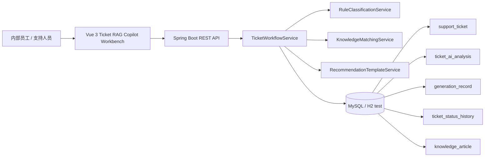

# Enterprise Ticket RAG Copilot

企业工单知识库智能助手。

这是一个面向 Java / AI 应用开发实习简历的 portfolio demo / learning project。项目把企业内部工单、关键词知识库匹配、RAG Reference 展示、模板化回复建议、Trace Evidence 证据链和 Human Review 人工确认组织成一个可演示的 Copilot 工作台。

当前 Copilot 指“辅助处理工作台”，不是生产级客服系统，也不代表已经接入真实大模型。默认分析链路使用 `local-rule fallback`：本地规则分类、关键词知识匹配、模板化建议草稿，并且所有状态流转、对外回复和知识发布都需要人工确认。

## 项目定位

- 面向企业内部员工、IT 支持、运维和业务支持团队的工单辅助处理原型。
- 面向简历和面试展示的第二项目，重点展示 Spring Boot 后端接口设计、状态流转、证据链聚合和 Vue 企业 SaaS 工作台。
- 用真实本地接口、演示数据和 Playwright 浏览器截图证明功能闭环。
- 明确边界：不是生产级系统，不是完整 Multi-Agent Runtime，不是无人值守自动关闭工单。

## 技术栈

- 前端：Vue 3、TypeScript、Vite、原生 CSS Design Tokens、Playwright Core 截图脚本。
- 后端：Java 17、Spring Boot 3、MyBatis-Plus、Maven、SpringDoc OpenAPI。
- 数据库：MySQL 8；测试环境使用 H2 内存库覆盖关键链路。
- 工程验证：JUnit / Spring Boot Test、`npm run build`、`npm run screenshots`、GitHub Actions CI。

## 核心能力

- 工单分类与优先级建议：根据标题、描述、系统名和错误日志做本地规则判断。
- 关键词知识库匹配：基于分类、工单文本和知识条目关键词计算匹配结果。
- RAG Reference 展示：展示知识标题、`sourcePath`、命中关键词、相关度、片段和是否用于草稿。
- AI 回复建议草稿：当前为模板化建议草稿，来自规则和知识命中，不是生产 LLM 生成。
- Trace Evidence 证据链：聚合 `ticket_ai_analysis`、`generation_record`、`ticket_status_history` 和 `knowledge_article`。
- Human Review 人工确认：状态流转、处理结论和知识发布都保留人工确认边界。
- local-rule fallback：默认 Provider 为 `local-rule fallback`，Model 为 `N/A (no LLM)`。

## 真实截图

以下图片由仓库内 `npm run screenshots` 通过真实浏览器从 Vue 前端页面生成。页面内容使用本地 Demo/Mock 数据，不包含真实企业或客户信息。


<table>
<tr>
<td width="50%">

<br />
工单详情与处理上下文
</td>
<td width="50%">

<br />
AI Analysis / generation_record 证据摘要
</td>
</tr>
<tr>
<td width="50%">

<br />
RAG Reference 与 Human Review
</td>
<td width="50%">

<br />
大尺寸工作台截图
</td>
</tr>
</table>

`docs/images/large/` 保存对应的 `1920x1200` 大屏版本，适合作品集排版或面试展示。

## 架构说明



核心流程：

1. 员工提交工单。
2. 后端使用本地规则完成分类、优先级建议和关键词知识匹配。
3. 模板服务生成排查步骤、回复建议和风险提示草稿。
4. `generation_record` 与 `ticket_status_history` 记录生成摘要和状态变化。
5. 前端通过 `/api/tickets/{id}/trace-evidence` 展示 Trace、Generation Record、RAG Reference 和 Human Review。
6. 支持人员人工确认状态流转或知识沉淀。

完整架构、状态机和字段边界见 [docs/architecture.md](docs/architecture.md) 与 [docs/trace-evidence.md](docs/trace-evidence.md)。

## API 摘要

| 方法 | 路径 | 用途 |
| --- | --- | --- |
| `GET` | `/api/health` | 健康检查 |
| `GET` | `/api/tickets` | 查询工单队列 |
| `POST` | `/api/tickets` | 创建工单并生成规则建议 |
| `GET` | `/api/tickets/metrics` | 查询工作台指标 |
| `GET` | `/api/tickets/{id}` | 查询工单详情与状态历史 |
| `GET` | `/api/tickets/{id}/ai-analysis` | 查询规则引擎辅助分析；路径为历史命名，不代表真实 LLM |
| `GET` | `/api/tickets/{id}/trace-evidence` | 查询 Trace Evidence、Generation Record、RAG Reference 和 Human Review |
| `POST` | `/api/tickets/{id}/status` | 人工确认状态流转 |
| `POST` | `/api/tickets/{id}/knowledge-draft` | 为已解决工单生成知识草稿 |
| `POST` | `/api/tickets/knowledge/{articleNo}/confirm` | 人工确认并发布知识草稿 |

后端启动后可访问 Swagger UI：[http://localhost:8080/swagger-ui/index.html](http://localhost:8080/swagger-ui/index.html)。人工整理版接口文档见 [docs/API.md](docs/API.md)。

## 运行方式

### 前端 Demo 模式

无需启动后端或 MySQL，即可使用本地 Demo/Mock 数据体验工作台：

```bash
cd frontend
npm install
npm run dev:demo
```

默认访问：`http://localhost:5173`

### 本地 MySQL 闭环

1. 创建数据库：

```sql
CREATE DATABASE enterprise_ai_ticket_copilot DEFAULT CHARACTER SET utf8mb4 COLLATE utf8mb4_unicode_ci;
```

2. 导入表结构和演示数据：

```bash
mysql -uroot -p < backend/src/main/resources/schema.sql
mysql -uroot -p enterprise_ai_ticket_copilot < backend/src/main/resources/demo-data.sql
```

3. 复制示例配置并填写本地数据库账号：

```powershell
Copy-Item backend/src/main/resources/application-example.yml backend/src/main/resources/application-local.yml
```

macOS / Linux：

```bash
cp backend/src/main/resources/application-example.yml backend/src/main/resources/application-local.yml
```

`application-local.yml` 已加入 `.gitignore`，不要提交真实用户名、密码或任何 API Key。

4. 启动后端：

```bash
cd backend
mvn spring-boot:run -Dspring-boot.run.profiles=local
```

5. 验证接口：

```bash
curl http://localhost:8080/api/health
curl http://localhost:8080/api/tickets
```

6. 启动前端真实后端模式：

```bash
cd frontend
npm install
npm run dev
```

## 测试结果

最近一次完整验证记录：

| 时间 | 命令 | 结果 |
| --- | --- | --- |
| 2026-06-27 | `cd backend && mvn test` | 通过，`Tests run: 21, Failures: 0, Errors: 0, Skipped: 0` |
| 2026-06-27 | `cd frontend && npm run build` | 通过，Vue 类型检查与 Vite 生产构建完成 |
| 2026-06-26 | `cd frontend && npm run screenshots` | 通过，刷新 `docs/images/*.png` 与 `docs/images/large/*.png` |

测试证据详见 [docs/TEST_REPORT.md](docs/TEST_REPORT.md)。本项目也包含 GitHub Actions workflow，会在 `push` 和 `pull_request` 时运行后端测试和前端构建。

## 项目边界

- 当前是 portfolio demo / learning project，不是生产级客服系统。
- 当前没有真实客户数据，截图和 demo 数据均为本地构造。
- 当前默认使用 `local-rule fallback`，真实 Provider 需要单独配置、实现和验证。
- 当前不是完整 Multi-Agent Runtime，没有 Tool Runtime，也没有自动规划执行链。
- 当前不会无人值守自动关闭工单；状态流转、回复和知识发布都需要人工确认。
- 当前知识检索是关键词匹配和 RAG Reference 展示，不是 embedding / 向量数据库。
- 当前没有生产级鉴权、RBAC、审计登录、限流、脱敏、监控、SLA 或生产部署说明。
- `runId` / `traceId` 是基于工单号派生的展示标识，不代表完整分布式 Trace / Span Runtime。

## 简历与面试材料

- [简历证据说明](docs/resume-evidence.md)
- [Trace Evidence 说明](docs/trace-evidence.md)
- [接口文档](docs/API.md)
- [架构说明](docs/architecture.md)
- [前端风格规范](docs/frontend-style.md)
- [测试执行报告](docs/TEST_REPORT.md)
- [演示脚本](docs/demo-script.md)
- [面试讲解指南](docs/interview-guide.md)

建议简历定位：`Enterprise Ticket RAG Copilot / 企业工单知识库智能助手`。面试时重点讲清楚“真实做了什么”和“没有夸大什么”：后端状态流转、证据链聚合、关键词 RAG Reference、人工确认边界和高保真 Vue 工作台。
