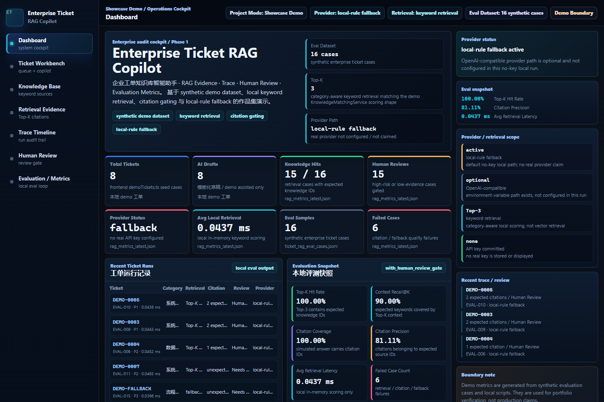
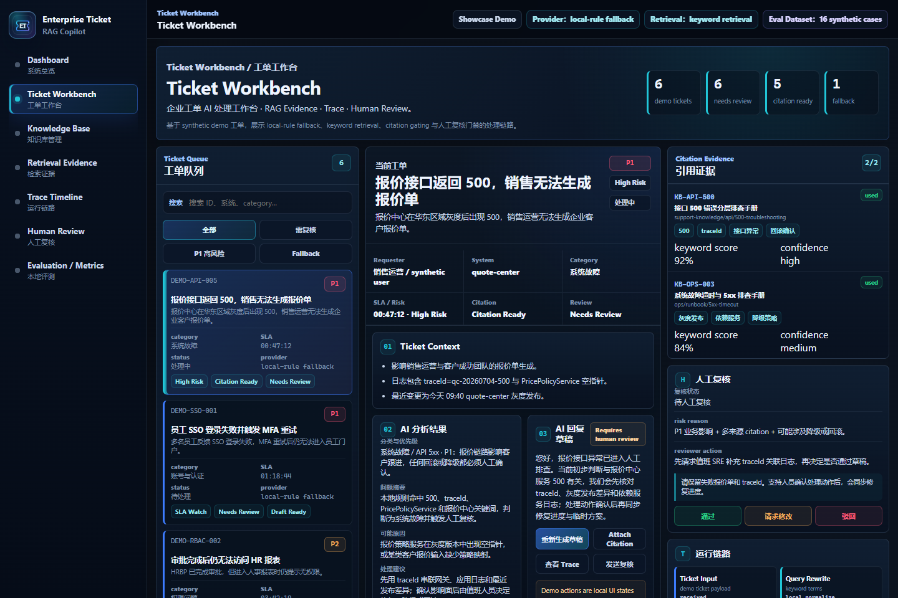
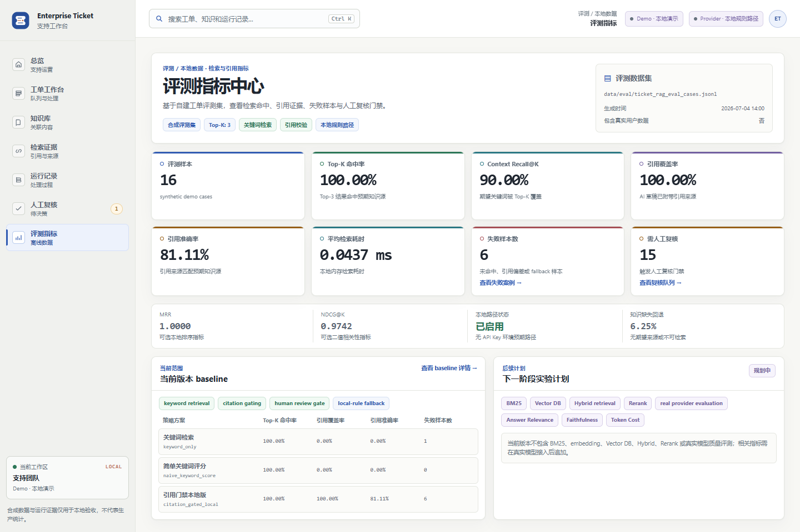
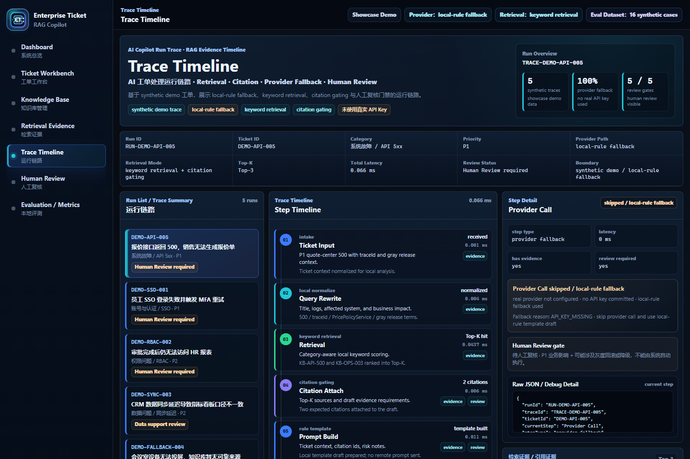
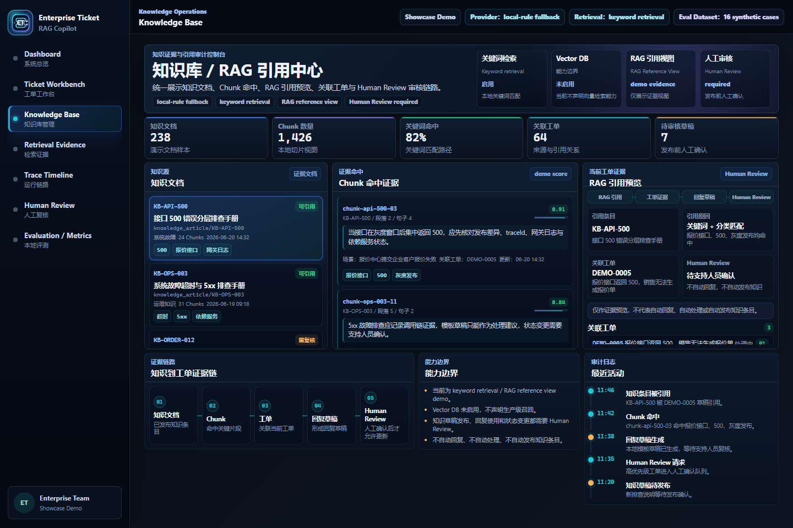
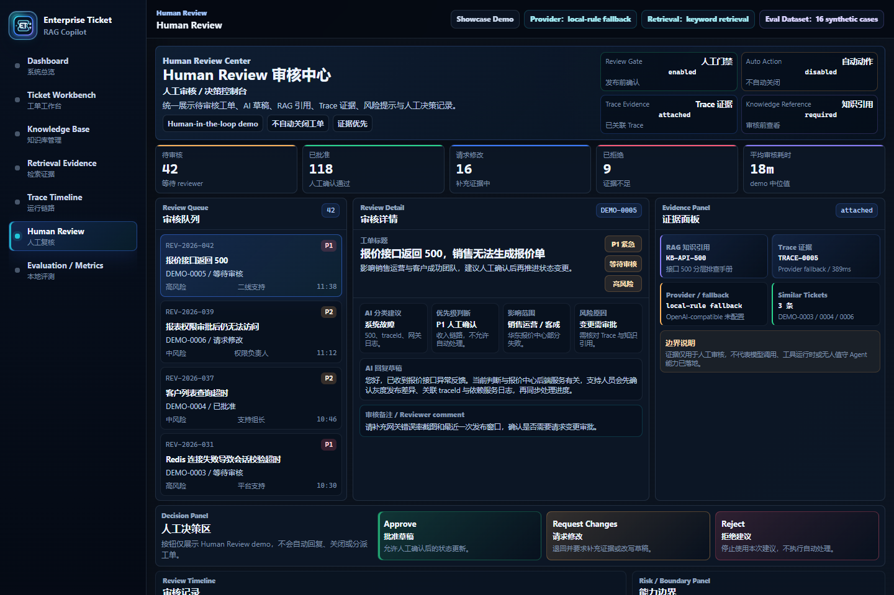
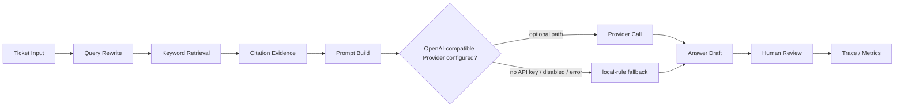

# Enterprise Ticket RAG Copilot

面向企业工单、客服支持和运维知识库场景的 AI RAG Copilot 作品集项目，用来展示工单分析、知识库检索、引用证据、Trace 运行链路、Human Review 门禁和本地 Evaluation / Metrics。

这是一个本地 demo / showcase 项目。当前默认链路使用 `local-rule fallback`、`keyword retrieval`、`citation gating` 和 `synthetic demo dataset`；OpenAI-compatible Provider 是可选配置路径，但本仓库不提交 API Key，也不把 demo 结果包装成对外运行服务、公司内部数据效果或稳定模型接入能力。

## 项目定位

Enterprise Ticket RAG Copilot 是一个企业工单知识库智能助手 demo，用来展示 AI 全栈开发能力、Java / Spring Boot 后端能力、Vue / TypeScript 前端能力，以及 RAG 可解释性、Trace 追踪、Human Review 和本地 Evaluation / Metrics。

它不是普通的“问答框 + 知识库上传”RAG demo。项目额外强调：

- **Ticket Workbench**：把工单队列、工单上下文、建议草稿和审核动作放在同一工作台。
- **Citation Evidence**：展示知识来源、命中关键词、引用状态和证据边界。
- **Trace Timeline**：展示从 Ticket Input 到 Human Review 的运行步骤和 fallback 原因。
- **Human Review Gate**：高风险动作、低证据场景和回复草稿都保留人工确认。
- **Evaluation / Metrics**：用本地 synthetic demo 评测集输出可复现指标快照。
- **Honest Boundaries**：明确区分 demo、local-rule、optional provider 和后续真实实验。

## Showcase

以下截图均来自本项目 `docs/images/*.png`，由仓库内 Vue Showcase 页面生成；不引用临时目录图片、外部产品截图或参考目标图。`docs/images/large/` 保存对应 `1920x1200` 大图，适合作品集展示或本地预览。

### 1. Dashboard — 系统总览

<a href="docs/images/large/dashboard.png">
  
</a>

系统总览页展示 Provider 状态、工单指标、Evaluation Snapshot、RAG / Trace / Review 入口和 demo 边界。

### 2. Ticket Workbench — 企业工单处理工作台

<a href="docs/images/large/ticket-workbench.png">
  
</a>

三栏工作台展示工单队列、工单详情、规则分析、AI Draft、Citation Evidence、Trace 入口和 Human Review 状态。

### 3. Evaluation / Metrics — 本地评测指标中心

<a href="docs/images/large/evaluation-metrics.png">
  
</a>

评测页面展示 16 条 synthetic demo 工单评测集、Top-K Hit Rate、Context Recall@K、Citation Coverage、Citation Precision、Failed Cases、Human Review gate 和 baseline 边界。

### 4. Trace Timeline — 运行链路与 Debug 证据

<a href="docs/images/large/trace-timeline.png">
  
</a>

Trace Timeline 展示 Ticket Input、Query Rewrite、Retrieval、Citation Attach、Prompt Build、Provider Call skipped、local-rule fallback、Answer Draft、Human Review 和 Raw JSON / Debug Detail。

### 5. Knowledge Base — 知识库与引用来源

<a href="docs/images/large/knowledge-base.png">
  
</a>

知识库页面展示知识来源、keyword retrieval、citation source、source / chunk / reference 管理和知识沉淀边界。

### 6. Human Review — 人工复核门禁

<a href="docs/images/large/human-review.png">
  
</a>

人工复核页展示风险原因、修改草稿、Approve / Request Changes / Reject 的审核动作和 demo 状态流转。

兼容截图：`docs/images/trace-evidence.png` 仍保留，用于旧 Trace Evidence 链接；当前内容与 Trace Timeline 页面一致。

## Core Features

- **Ticket Workbench**：企业工单队列、详情上下文、规则分析结果、建议草稿和审核入口。
- **Knowledge Base**：知识来源、关键词命中、引用片段和知识沉淀状态。
- **Retrieval Evidence**：Top-K keyword retrieval、citation IDs、命中关键词和证据摘要。
- **Trace Timeline**：Ticket Input、Query Rewrite、Retrieval、Citation Attach、Provider skipped、fallback、Answer Draft、Human Review 和 Raw JSON。
- **Human Review**：高风险或低证据场景进入人工确认，展示 approve / request changes / reject 状态。
- **Evaluation / Metrics**：本地 synthetic demo 评测集、baseline、指标快照和失败样本解释。
- **Provider Boundary**：OpenAI-compatible provider 可选；未配置 Key 时走 local-rule fallback，并记录 provider path 与 reason。
- **Citation Gating**：建议草稿必须展示引用来源或进入 fallback / review。
- **Local Demo Dataset**：前端 showcase 和评测脚本都可在本地无外部服务运行。

## Tech Stack

| 层级 | 技术 |
| --- | --- |
| 后端 | Java 17、Spring Boot 3、MyBatis-Plus、Bean Validation、SpringDoc OpenAPI |
| 数据 | MySQL-compatible schema；H2 用于自动化测试 |
| 前端 | Vue 3、TypeScript、Vite、原生 CSS Design Tokens |
| 工程 | Maven、JUnit / Spring Boot Test、Playwright screenshot pipeline、GitHub Actions CI |
| AI / RAG / Evaluation | keyword retrieval、citation gating、local-rule fallback、OpenAI-compatible provider optional path、synthetic demo evaluation dataset、RAG metrics script |

后端接口覆盖工单流转、知识匹配、Trace Evidence、Provider / fallback、JWT + RBAC demo 和 Human Review。完整接口以 [docs/API.md](docs/API.md) 和本地 Swagger UI 为准。

## Architecture / Workflow


```mermaid
flowchart LR
  ticket["Ticket Input"] --> rewrite["Query Rewrite"]
  rewrite --> retrieval["Keyword Retrieval"]
  retrieval --> citation["Citation Evidence"]
  citation --> prompt["Prompt Build"]
  prompt --> provider{"OpenAI-compatible Provider configured?"}
  provider -- "optional path" --> model["Provider Call"]
  provider -- "no API key / disabled / error" --> fallback["local-rule fallback"]
  model --> draft["Answer Draft"]
  fallback --> draft
  draft --> review["Human Review"]
  review --> trace["Trace / Metrics"]
```

Provider Call 是可选路径；未配置临时环境变量或调用失败时会记录 fallback reason，并使用本地规则与模板草稿继续 demo。状态变化、知识发布和对外回复都不应绕过 Human Review。

## Evaluation / Metrics

本项目补充了一个本地可复现的 RAG / Citation / Trace Evaluation 最小闭环，用于验证 demo 的 keyword retrieval、citation gating 和 Human Review gate 是否可解释。

| 项目 | 当前值 |
| --- | --- |
| 评测集 | [data/eval/ticket_rag_eval_cases.jsonl](data/eval/ticket_rag_eval_cases.jsonl) |
| 样本数量 | 16 条 synthetic enterprise ticket demo cases |
| 评测脚本 | [scripts/evaluate_rag_demo.py](scripts/evaluate_rag_demo.py) |
| 指标 JSON | [docs/metrics/rag_metrics_latest.json](docs/metrics/rag_metrics_latest.json) |
| 指标快照 | [docs/metrics/rag_metrics_snapshot.md](docs/metrics/rag_metrics_snapshot.md) |
| 评测方案 | [docs/evaluation/RAG_EVALUATION_PLAN.md](docs/evaluation/RAG_EVALUATION_PLAN.md) |

运行命令：

```powershell
py .\scripts\evaluate_rag_demo.py
```

当前快照来自 `docs/metrics/rag_metrics_latest.json`，Top-K = 3：

| 指标 | 当前结果 | 说明 |
| --- | ---: | --- |
| Samples | 16 | synthetic demo cases |
| Top-K Hit Rate | 100.00% | 有期望知识 ID 的样本中，Top-3 至少命中一个期望来源 |
| Context Recall@K | 90.00% | 期望关键词在 Top-3 demo 知识上下文中的平均覆盖 |
| Citation Coverage | 100.00% | 需要引用的样本均附带模拟 citation IDs |
| Citation Precision | 81.11% | citation IDs 中属于期望知识 ID 的比例 |
| Avg Retrieval Latency | 0.0437 ms | 本地内存关键词评分耗时，不代表线上性能 |
| Failed Case Count | 6 | 引用包含非期望来源或缺知识时误召回的 demo 失败样本数 |
| Human Review Required Count | 15 | 高风险、低证据或需要人工门禁的样本数 |

Provider / fallback 边界不作为核心质量指标展示：

| 路径 | 当前说明 |
| --- | --- |
| Local fallback path | enabled |
| No API key mode | expected local-rule fallback |
| Provider path | local-rule fallback |
| Real provider | not configured in this README snapshot |

当前未配置真实 API Key，默认走 local-rule fallback，这是本地 demo 的预期路径，不代表生产失败率。

这些结果来自 synthetic demo dataset + local keyword retrieval + citation gating，不代表真实向量检索、真实模型质量、real online effect 或公司内部数据效果。

### Baseline / Scope

当前已实现 baseline：

- `keyword_only`
- `naive_keyword_score`
- `with_citation_required`
- `with_human_review_gate`
- `local-rule fallback`

下一阶段可以独立比较：

- BM25
- Vector DB
- Hybrid retrieval
- Rerank
- real provider evaluation
- Answer Relevance
- Faithfulness
- Token Cost

当前版本没有实现 Vector DB、Hybrid、Rerank 或真实模型质量评测；只有实际跑通并保存证据后，才能把新指标写入 `docs/metrics/`。

## Local Run

### 前端 Showcase

无需后端或 MySQL，直接使用本地 demo 数据：

```bash
cd frontend
npm install
npm run dev:demo
```

默认访问 `http://localhost:5173`。可通过 hash 进入页面：

- `#dashboard`
- `#ticket-detail`
- `#evaluation-metrics`
- `#trace-timeline`
- `#knowledge-base`
- `#human-review`

前端验证与截图：

```bash
cd frontend
npm run build
npm run screenshots
```

`npm run screenshots` 会重新生成 `docs/images/` 中的已跟踪图片；只查看项目时不必执行。

### 后端测试与启动

```bash
cd backend
mvn test
mvn spring-boot:run
```

如需连接本地 MySQL，请先复制配置模板并填写自己的本机账号：

```powershell
Copy-Item backend/src/main/resources/application-example.yml backend/src/main/resources/application-local.yml
```

macOS / Linux：

```bash
cp backend/src/main/resources/application-example.yml backend/src/main/resources/application-local.yml
```

`application-local.yml` 已加入 `.gitignore`，不要提交数据库密码或 API Key。后端启动后可访问：

- 健康检查：`http://localhost:8080/api/health`
- Swagger UI：`http://localhost:8080/swagger-ui/index.html`

### 本地评测

```powershell
py .\scripts\evaluate_rag_demo.py
```

脚本只使用 Python 标准库，读取本地评测集和内置 demo 知识语料，不连接 MySQL，不调用真实 Provider，不读取 API Key。

### 可选 Provider 调试

项目保留 OpenAI-compatible Provider 调试路径。仅使用临时环境变量，不要把真实 Key 写入仓库：

```powershell
$env:TICKET_AI_PROVIDER="openai-compatible"
$env:TICKET_AI_BASE_URL="<OpenAI-compatible base URL>"
$env:TICKET_AI_MODEL="<model name>"
$env:TICKET_AI_API_KEY="<temporary API key>"
$env:TICKET_AI_FALLBACK_TO_LOCAL="true"
```

具体调用与清理步骤见 [docs/real-provider-verification.md](docs/real-provider-verification.md)。无论 Provider 是否可用，状态变化和对外回复仍需 Human Review。

## 验证结果

| 验证项 | 最近记录 |
| --- | --- |
| `cd frontend && npm run build` | 通过：Vue 类型检查与 Vite 生产构建完成 |
| `cd frontend && npm run screenshots` | 通过：覆盖 Showcase 路由及 1366 / 390 宽度溢出检查 |
| `cd backend && mvn test` | 通过：`Tests run: 24, Failures: 0, Errors: 0, Skipped: 0` |
| `py .\scripts\evaluate_rag_demo.py` | 通过：16 cases，Top-K 100.00%，Context Recall@K 90.00%，Citation Coverage 100.00%，Citation Precision 81.11% |

测试记录见 [docs/TEST_REPORT.md](docs/TEST_REPORT.md)。本轮 README 整合只修改文档，没有重新运行构建、测试或截图脚本。

## Resume Bullets

可写：

> 企业工单 RAG Copilot：基于 Spring Boot + Vue 3 实现企业工单知识库智能助手，支持工单分析、keyword retrieval、引用证据、Trace Timeline 与 Human Review 门禁，并构建 16 条 synthetic demo 评测集统计 Top-K Hit Rate、Context Recall@K、Citation Coverage / Precision 等指标。

> 设计 local-rule fallback 作为无 API Key 环境下的安全演示路径，并保留 OpenAI-compatible Provider optional path，避免把 demo 输出误写成外部模型质量结论。

更短版：

> 实现企业工单 RAG Copilot Demo，覆盖 Ticket Workbench、Citation Evidence、Trace Timeline、Human Review 与本地 Evaluation / Metrics，基于 16 条自建 synthetic 工单评测集输出可复现指标快照。

不建议写：

- 服务公司内部用户或客户。
- 稳定接入真实模型。
- 向量检索已经落地。
- 自动处理或关闭工单。
- 夸大百分比式准确率、夸张提升比例或收益表述。

## Interview Talking Points

- **为什么不只是普通 RAG demo**：它不是单一问答页，而是覆盖工单工作台、证据引用、Trace、人工复核和本地评测。
- **为什么先做 keyword retrieval baseline**：关键词 baseline 可本地复现、易解释、便于暴露误召回和 citation precision 问题。
- **如何设计 synthetic eval dataset**：覆盖账号、权限、数据、故障、部署、SLA、回滚、缺知识 fallback 和易误判相似问题。
- **如何解释指标**：Top-K Hit Rate 看是否召回期望知识；Context Recall 看关键词覆盖；Citation Precision 看引用是否属于期望来源。
- **为什么 Human Review Required Count 高**：工单场景常涉及权限、故障、数据修复和回滚，demo 故意把风险留给人工确认。
- **为什么 local-rule fallback 是安全演示路径**：没有 Key 或 Provider 失败时仍可演示完整链路，同时不伪造外部模型结果。
- **下一阶段如何升级**：固定同一评测集，对比 BM25 / Vector / Hybrid / Rerank，再接入临时 Provider 做 Answer Relevance、Faithfulness 和成本评估。

## Honest Boundaries

- 当前项目使用 synthetic demo tickets 和本地 showcase 常量。
- 默认生成路径是 local-rule fallback，不是外部模型稳定响应。
- 当前检索为 keyword retrieval，不是 embedding / Vector DB。
- 当前 citation gating 是本地 demo 逻辑，用于展示证据约束和失败样本。
- `no real API key committed`；仓库不提交数据库密码或个人本地配置。
- `not production data`；`not real online traffic`；不使用客户数据。
- OpenAI-compatible Provider 是 optional path；只有实际跑通并记录证据后，才能写入新的指标或结论。
- 当前 README 中的评测指标不代表真实向量 RAG、`not real model quality result`、real online effect 或 production data result。
- Human Review 是 demo gate，不是生产级审核任务平台。
- `runId` / `traceId` 是展示标识，不代表完整分布式 Trace / Span Runtime。
- Showcase 截图证明页面可复现，不等同于真实联调或部署证据。

## 延伸材料

- [架构与状态流转](docs/architecture.md)
- [REST API 文档](docs/API.md)
- [Trace Evidence 字段与边界](docs/trace-evidence.md)
- [Evaluation Plan](docs/evaluation/RAG_EVALUATION_PLAN.md)
- [Metrics Snapshot](docs/metrics/rag_metrics_snapshot.md)
- [JWT + RBAC Demo](docs/auth-rbac-demo.md)
- [测试执行报告](docs/TEST_REPORT.md)
- [简历证据说明](docs/resume-evidence.md)
- [演示脚本](docs/demo-script.md)
- [面试讲解指南](docs/interview-guide.md)
