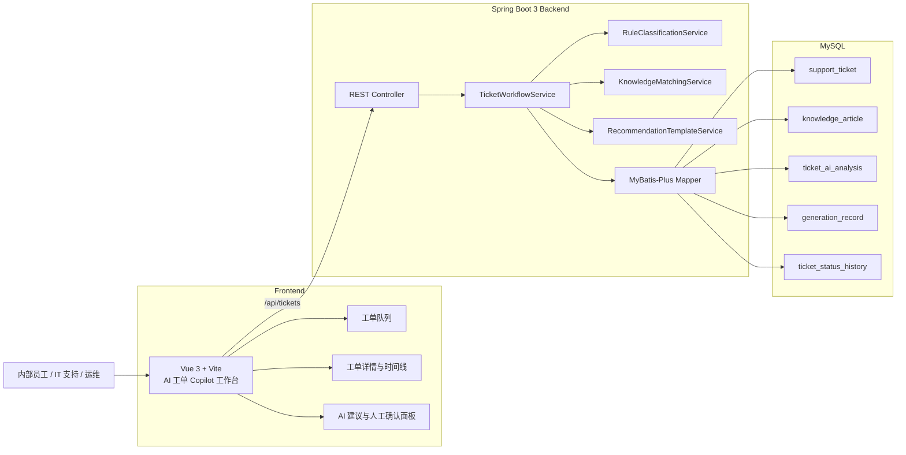
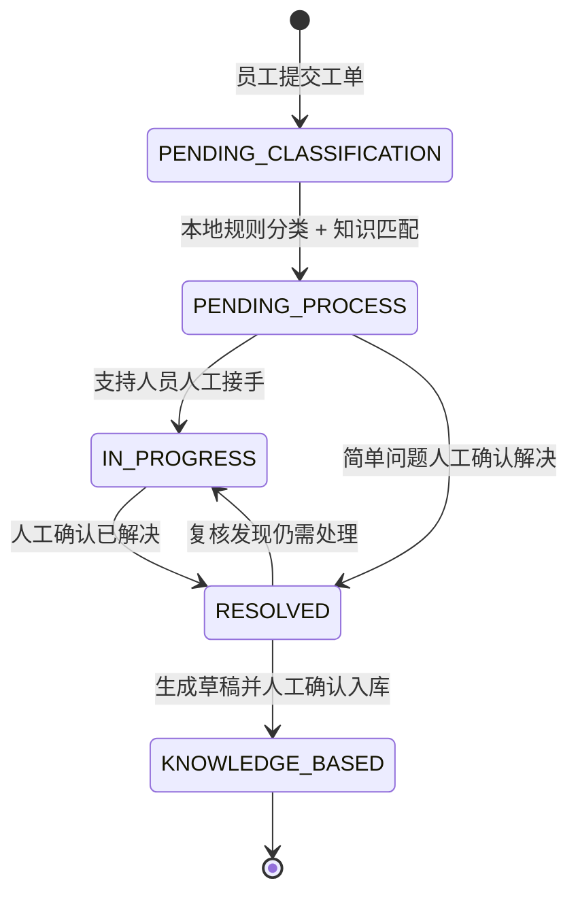
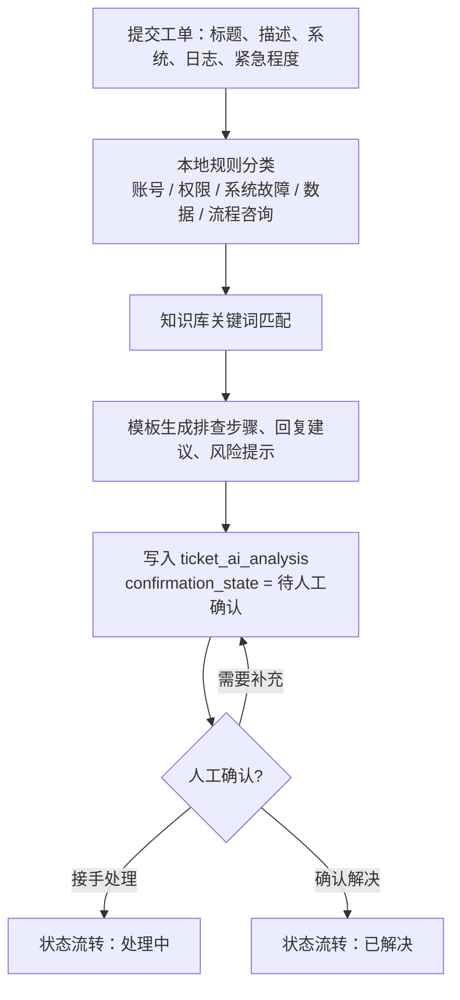
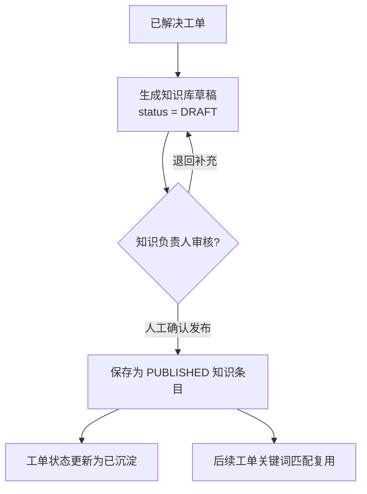

# 架构说明

Enterprise AI Ticket Copilot 是一个面向企业内部员工、IT 支持、运维和业务支持团队的 AI 工单与知识库助手。第 2 阶段仍不接真实 LLM，所有分析结果来自本地规则、关键词匹配和模板生成，并且必须经过人工确认后进入状态流转或知识沉淀。

## 前后端架构图

## 工单状态流转图

## AI 分析 + 人工确认流程图

## 知识沉淀流程图

## 边界约束

- 不连接真实 LLM，不发送工单内容到外部模型。
- 不自动执行授权、回滚、重启、通知、爬虫或外部系统操作。
- 规则分析、处理建议、知识草稿都只作为人工确认前的辅助信息。
- `generation_record` 保存规则或模板输出来源、输入摘要、输出摘要、耗时和状态，便于审计。
