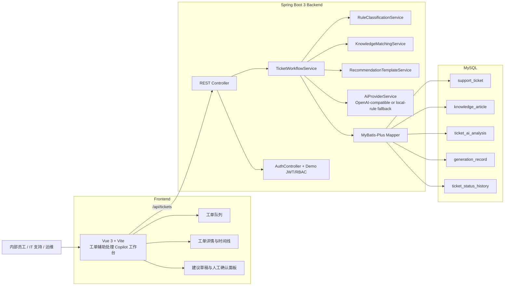
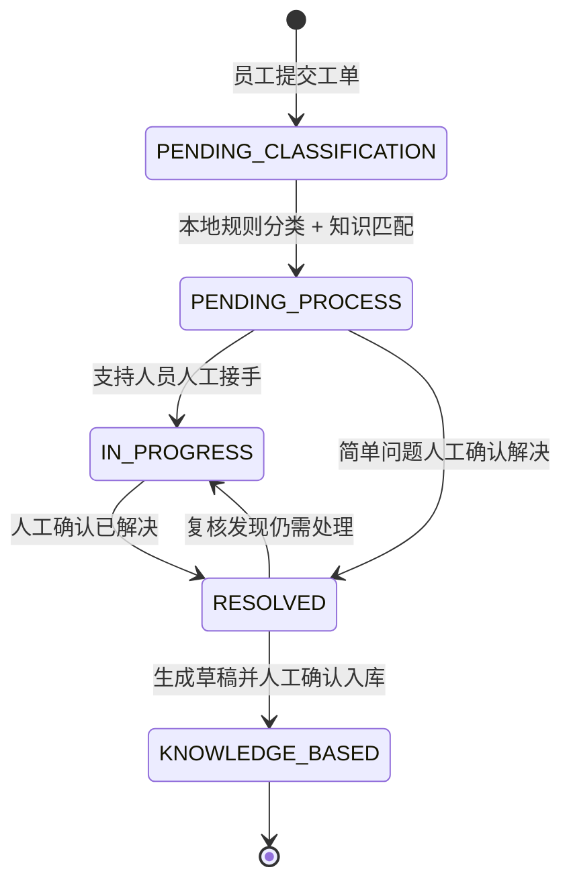
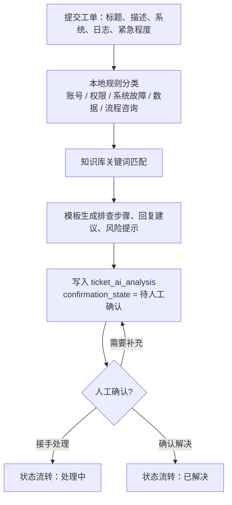
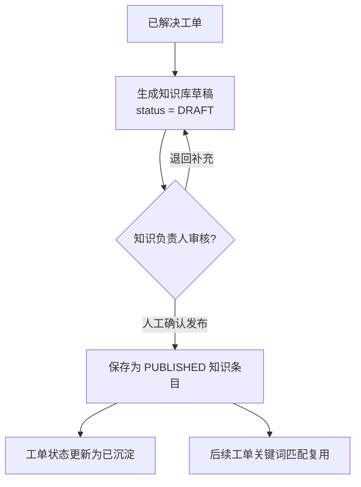

# 架构说明

Enterprise Ticket RAG Copilot 是一个面向企业内部员工、IT 支持、运维和业务支持团队的工单辅助处理与知识库工作台。Copilot 在本项目中表示辅助处理工作台，不代表生产级自动客服。当前默认链路使用本地规则、关键词匹配和模板生成；配置临时环境变量后可走 OpenAI-compatible Provider `/chat/completions` 代码路径，失败或未配置 Key 时自动回退到 local-rule fallback。所有建议必须经过人工确认后进入状态流转或知识沉淀。

## 前后端架构图

## 工单状态流转图

## 规则分析 + 人工确认流程图

## 知识沉淀流程图

## Trace Evidence 聚合来源

`GET /api/tickets/{id}/trace-evidence` 是只读聚合接口，用于把一张工单的分析、生成记录、知识引用和人工确认状态集中展示给前端。它不新增执行动作，也不代表完整 Agent Runtime。

| 聚合来源 | 用途 | 字段示例 |
| --- | --- | --- |
| `ticket_ai_analysis` | 最近一次规则引擎辅助分析 | `analysisId`、`classification`、`confidence`、`confirmationState`、`createdAt` |
| `generation_record` | 记录规则或模板输出摘要 | `recordId`、`sourceType`、`latencyMs`、`status`、`promptSummary`、`responseSummary`、`createdAt` |
| `ticket_status_history` | 记录人工确认后的状态变化 | `fromStatus`、`toStatus`、`actor`、`note`、`occurredAt` |
| `knowledge_article` | 提供关键词知识引用 | `knowledgeTitle`、`sourcePath`、`snippet`、`sourceTicketId` |

## 真实字段与安全派生字段

真实接口数据来自现有表和现有服务逻辑。例如 `analysisId` 来自 `ticket_ai_analysis.id`，`recordId` 和 `latencyMs` 来自 `generation_record`，状态历史来自 `ticket_status_history`，知识标题和片段来自 `knowledge_article`。

安全派生字段用于前端关联展示，不应解释成生产级运行时能力：

- `runId` / `traceId` 基于工单号派生，不是分布式 Trace / Span Runtime。
- `currentStep` 由工单状态映射。
- `totalLatency` 是当前工单关联的 `generation_record.latency_ms` 求和。
- `providerName` / `modelName` 来自 `generation_record`，默认是 `local-rule` / `N/A (no LLM)`；真实 Provider 路径会记录配置的 provider/model。
- `fallbackUsed` / `fallbackReason` 来自 `generation_record`，用于说明 `API_KEY_MISSING`、`BASE_URL_MISSING`、`PROVIDER_DISABLED`、`PROVIDER_ERROR`、`TIMEOUT` 或 `PARSE_ERROR`。
- `fallbackStrategy` 根据 `generation_record.source_type` 映射为规则分类、关键词引用或模板草稿。
- `humanReview` 从状态历史中的人工 actor 推导，不是独立审核任务系统。

## 边界约束

- 默认不连接真实 LLM；只有显式配置 `TICKET_AI_*` 临时环境变量时才尝试 OpenAI-compatible Provider，且本轮没有真实 Key 验证记录。
- 不自动执行授权、回滚、重启、通知、爬虫或外部系统操作。
- 规则分析、处理建议、知识草稿都只作为人工确认前的辅助信息。
- `generation_record` 保存规则或模板输出来源、输入摘要、输出摘要、耗时和状态，便于审计。
- `/api/tickets/{id}/trace-evidence` 只读聚合 `ticket_ai_analysis`、`generation_record`、`ticket_status_history` 和 `knowledge_article`；其中 `runId/traceId` 是基于工单号派生的展示标识，不代表完整 Trace / Span Runtime。
- 知识检索当前是关键词匹配和 RAG Reference 展示，不是 embedding / 向量数据库。
- 当前 JWT + RBAC 是 demo 级控制，不是生产级权限体系；当前没有 Tool Runtime、完整 Multi-Agent Runtime 或无人值守自动处理闭环。
