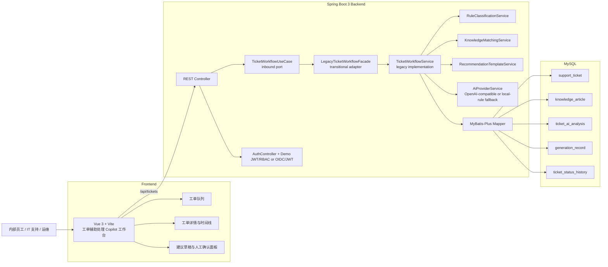
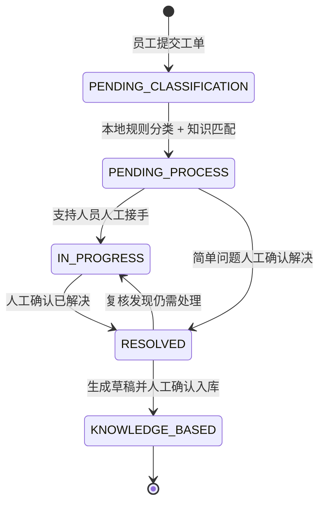
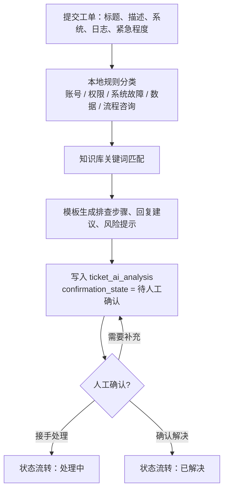
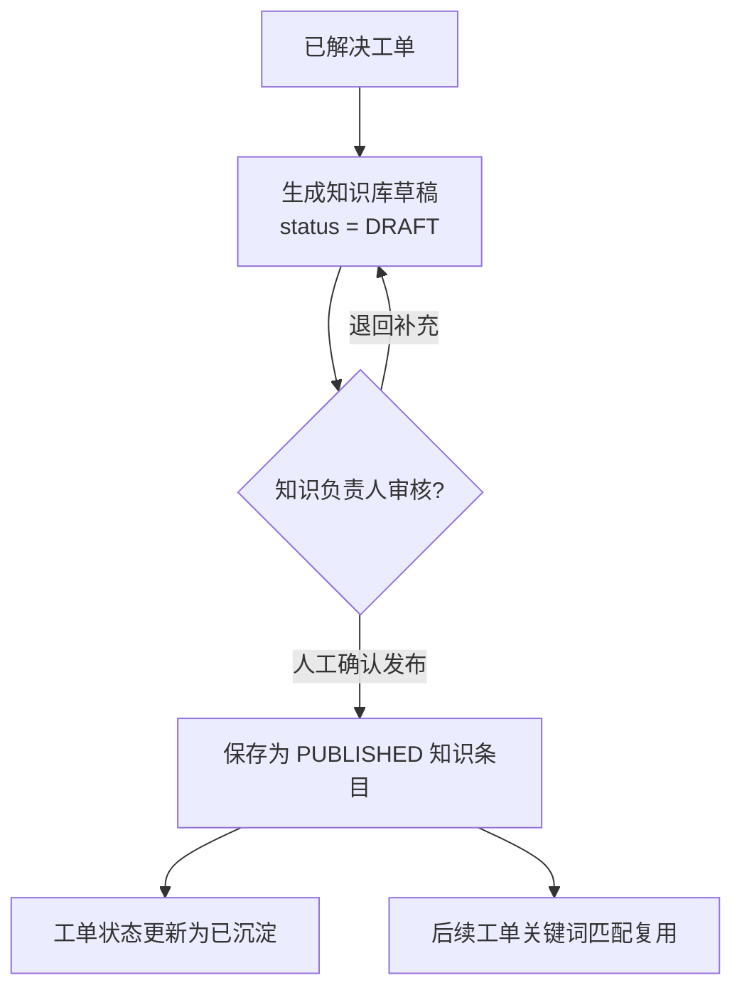

# 架构说明

> 后端当前处于 T0 契约冻结 + T1 入站边界 + T2 策略端口 + Phase 0-A 状态/授权加固阶段，并已补齐 OIDC/JWT Resource Server 与 staging 部署骨架：旧 `/api/...` 路径、状态词汇和证据链保持兼容，REST 入口已通过入站应用端口隔离旧工作流服务，工作流已通过 `ReviewPolicy` 隔离复核策略，状态和写权限分别由集中策略约束；后续完整模块化迁移按照 [Backend T0 API 契约冻结](design/BACKEND_T0_API_CONTRACT.md)、[Backend T1 模块边界](design/BACKEND_T1_MODULE_BOUNDARIES.md)、[Backend T2 工作流策略端口](design/BACKEND_T2_WORKFLOW_PORTS.md)、[Phase 0-A 状态与授权说明](design/TICKET_WORKFLOW_STATE_AND_AUTHORIZATION.md) 和 [后端下一阶段设计](design/BACKEND_NEXT_PHASE_DESIGN.md) 逐步进行。真实认证、Provider 和部署参数见 [真实认证、Provider 与部署说明](REAL_AUTH_PROVIDER_DEPLOYMENT.md)。

Enterprise Ticket RAG Copilot 是一个面向企业内部员工、IT 支持、运维和业务支持团队的工单辅助处理与知识库工作台。Copilot 在本项目中表示辅助处理工作台，不代表生产级自动客服。当前默认链路使用本地规则、关键词匹配和模板生成；配置临时环境变量后可走 OpenAI-compatible Provider `/chat/completions` 代码路径，失败或未配置 Key 时自动回退到 local-rule fallback。所有建议必须经过人工确认后进入状态流转或知识沉淀。

## 前后端架构图


```mermaid
flowchart LR
  user["内部员工 / IT 支持 / 运维"] --> web["Vue 3 + Vite<br/>工单辅助处理 Copilot 工作台"]

  subgraph frontend["Frontend"]
    web --> queue["工单队列"]
    web --> detail["工单详情与时间线"]
    web --> ai_panel["建议草稿与人工确认面板"]
  end

  subgraph backend["Spring Boot 3 Backend"]
    api["REST Controller"] --> workflow["TicketWorkflowUseCase<br/>inbound port"]
    workflow --> legacy["LegacyTicketWorkflowFacade<br/>transitional adapter"]
    legacy --> service["TicketWorkflowService<br/>legacy implementation"]
    api --> auth["AuthController + Demo JWT/RBAC or OIDC/JWT"]
    service --> classifier["RuleClassificationService"]
    service --> matcher["KnowledgeMatchingService"]
    service --> template["RecommendationTemplateService"]
    service --> provider["AiProviderService<br/>OpenAI-compatible or local-rule fallback"]
    service --> mapper["MyBatis-Plus Mapper"]
  end

  subgraph mysql["MySQL"]
    support_ticket["support_ticket"]
    knowledge_article["knowledge_article"]
    ticket_ai_analysis["ticket_ai_analysis"]
    generation_record["generation_record"]
    ticket_status_history["ticket_status_history"]
  end

  web -->|/api/tickets| api
  mapper --> support_ticket
  mapper --> knowledge_article
  mapper --> ticket_ai_analysis
  mapper --> generation_record
  mapper --> ticket_status_history
```

## 工单状态流转图


```mermaid
stateDiagram-v2
  [*] --> PENDING_CLASSIFICATION: 员工提交工单
  PENDING_CLASSIFICATION --> PENDING_PROCESS: 本地规则分类 + 知识匹配
  PENDING_PROCESS --> IN_PROGRESS: 支持人员人工接手
  IN_PROGRESS --> RESOLVED: 人工确认已解决
  RESOLVED --> KNOWLEDGE_BASED: 生成草稿并人工确认入库
  KNOWLEDGE_BASED --> [*]

  PENDING_PROCESS --> RESOLVED: 简单问题人工确认解决
RESOLVED --> IN_PROGRESS: 复核发现仍需处理
```

## Phase 0-A 状态策略与写权限

状态图中的合法边、审核 Run 前置条件、知识发布边界、条件更新并发保护，以及 ADMIN / AGENT / REVIEWER / VIEWER 的写权限矩阵，统一记录在 [企业 AI 工单状态转移与写接口授权](design/TICKET_WORKFLOW_STATE_AND_AUTHORIZATION.md)。所有未被现有源码、架构说明和 Showcase 流程明确支持的已知状态边均保持拒绝，不用通用目标白名单替代状态机判断。

## 规则分析 + 人工确认流程图


```mermaid
flowchart TD
  intake["提交工单：标题、描述、系统、日志、紧急程度"] --> classify["本地规则分类<br/>账号 / 权限 / 系统故障 / 数据 / 流程咨询"]
  classify --> match["知识库关键词匹配"]
  match --> recommend["模板生成排查步骤、回复建议、风险提示"]
  recommend --> pending["写入 ticket_ai_analysis<br/>confirmation_state = 待人工确认"]
  pending --> human{"人工确认?"}
  human -- 接手处理 --> in_progress["状态流转：处理中"]
  human -- 需要补充 --> pending
  human -- 确认解决 --> resolved["状态流转：已解决"]
```

## 知识沉淀流程图


```mermaid
flowchart TD
  resolved["已解决工单"] --> draft["生成知识库草稿<br/>status = DRAFT"]
  draft --> review{"知识负责人审核?"}
  review -- 退回补充 --> draft
  review -- 人工确认发布 --> publish["保存为 PUBLISHED 知识条目"]
  publish --> ticket_state["工单状态更新为已沉淀"]
  publish --> reuse["后续工单关键词匹配复用"]
```

## Trace Evidence 聚合来源

`GET /api/tickets/{id}/trace-evidence` 是只读聚合接口，用于把一张工单的分析、生成记录、知识引用和人工确认状态集中展示给前端。它不新增执行动作，也不代表完整 Agent Runtime。

| 聚合来源 | 用途 | 字段示例 |
| --- | --- | --- |
| `ticket_ai_analysis` | 最近一次规则引擎辅助分析 | `analysisId`、`classification`、`confidence`、`confirmationState`、`createdAt` |
| `generation_record` | 记录规则或模板输出摘要 | `recordId`、`sourceType`、`latencyMs`、`status`、`promptSummary`、`responseSummary`、`createdAt` |
| `ticket_status_history` | 记录人工确认后的状态变化 | `fromStatus`、`toStatus`、`actor`、`note`、`occurredAt` |
| `knowledge_article` | 提供关键词知识引用 | `knowledgeTitle`、`sourcePath`、`snippet`、`sourceTicketId` |

## Evaluation Artifacts

本项目新增本地 RAG / Citation / Trace Evaluation 最小闭环，用于验证 demo keyword retrieval、citation gating 和 Human Review gate 的可解释性。它不属于线上运行链路，不连接真实 Provider，不读写 MySQL，也不代表生产级模型效果。

| 路径 | 用途 |
| --- | --- |
| `data/eval/ticket_rag_eval_cases.jsonl` | 16 条 synthetic enterprise ticket demo cases |
| `scripts/evaluate_rag_demo.py` | 仅使用 Python 标准库的本地评测脚本 |
| `docs/evaluation/RAG_EVALUATION_PLAN.md` | 评测目标、样本字段、指标、baseline 和下一阶段计划 |
| `docs/metrics/rag_metrics_latest.json` | 最新一次本地评测 JSON 结果 |
| `docs/metrics/rag_metrics_snapshot.md` | 适合 README / 面试说明引用的指标快照 |

## 真实字段与安全派生字段

真实接口数据来自现有表和现有服务逻辑。例如 `analysisId` 来自 `ticket_ai_analysis.id`，`recordId` 和 `latencyMs` 来自 `generation_record`，状态历史来自 `ticket_status_history`，知识标题和片段来自 `knowledge_article`。

安全派生字段用于前端关联展示，不应解释成生产级运行时能力：

- `runId` / `traceId` 基于工单号派生，不是分布式 Trace / Span Runtime。
- `currentStep` 由工单状态映射。
- `totalLatency` 是当前工单关联的 `generation_record.latency_ms` 求和。
- `providerName` / `modelName` 来自 `generation_record`，默认是 `local-rule` / `N/A (no LLM)`；真实 Provider 路径会记录配置的 provider/model。
- `fallbackUsed` / `fallbackReason` 来自 `generation_record`，用于说明 `API_KEY_MISSING`、`BASE_URL_MISSING`、`PROVIDER_DISABLED`、`PROVIDER_ERROR`、`TIMEOUT` 或 `PARSE_ERROR`。
- `fallbackStrategy` 根据 `generation_record.source_type` 映射为规则分类、关键词引用或模板草稿。
- `humanReview` 从状态历史中的人工 actor 推导，不是独立审核任务系统。

## 边界约束

- 默认不连接真实 LLM；只有显式配置 `TICKET_AI_*` 临时环境变量时才尝试 OpenAI-compatible Provider，且本轮没有真实 Key 验证记录。
- 不自动执行授权、回滚、重启、通知、爬虫或外部系统操作。
- 规则分析、处理建议、知识草稿都只作为人工确认前的辅助信息。
- `generation_record` 保存规则或模板输出来源、输入摘要、输出摘要、耗时和状态，便于审计。
- `/api/tickets/{id}/trace-evidence` 只读聚合 `ticket_ai_analysis`、`generation_record`、`ticket_status_history` 和 `knowledge_article`；其中 `runId/traceId` 是基于工单号派生的展示标识，不代表完整 Trace / Span Runtime。
- 知识检索当前是关键词匹配和 RAG Reference 展示，不是 embedding / 向量数据库。
- Evaluation 指标来自本地 synthetic demo 评测集，不代表真实线上用户、真实模型准确率或真实向量 RAG 效果。
- 当前 JWT + RBAC 是 demo 级控制，不是生产级权限体系；当前没有 Tool Runtime、完整 Multi-Agent Runtime 或无人值守自动处理闭环。

## Immutable Copilot Run Trace Foundation (2026-07-30)

`POST /api/tickets/{id}/run-copilot` now persists an immutable runtime evidence record for each Copilot run. The persisted chain is:

- `copilot_run`: one row per run with unique `run_id` / `trace_id`, requested Provider/protocol/model, actual Provider/protocol, run status, fallback reason, provider error category, sanitized error summary, latency, output flag and human-review flag.
- `retrieval_hit`: append-only retrieval snapshot rows linked to `copilot_run.run_id`; each row stores rank, article id/no, title/category snapshots, score, matched keyword snapshot, excerpt snapshot and whether the hit was used in the draft context.
- `review_record`: append-only human review decisions linked to the latest run when one exists; legacy manual status changes before a run may have `run_id = NULL`.

`GET /api/tickets/{id}/trace-evidence` remains backward compatible. Tickets without a persisted run return `evidenceSource=LEGACY_DERIVED`; tickets with a run return `evidenceSource=IMMUTABLE_RUN` and replay RAG references from `retrieval_hit` snapshots instead of recalculating them from the mutable knowledge base. This phase does not add vector retrieval, Citation Validation, frontend changes, external Provider calls, or automated ticket closure.

## Structured Output, Citation Validation and Abstention (2026-07-30)

New Copilot runs now normalize Provider or local-rule output into a structured contract before saving an operator-facing result. The runtime builds Provider prompts from the current run's immutable `retrieval_hit` snapshots only: article number as `knowledgeArticleId`, title snapshot, category snapshot, bounded excerpt snapshot, and score. It does not send full knowledge articles, `errorLog`, external URLs, API keys, Authorization headers, or secrets, and it does not persist the full prompt.

The accepted result is persisted in `copilot_result`; validated Citation relationships are persisted in `copilot_result_citation` and point back to `retrieval_hit`. `RETRIEVAL_REFERENCE`, `MODEL_CITATION`, and `VALIDATED_CITATION` are distinct concepts: validation means the model's Citation ID exactly matched an allowed current-run `knowledgeArticleNo`, not an internal numeric database ID, URL, or sentence-level factual entailment. Persisted validated excerpts are retrieval snapshots, not model-authored excerpts or supported-claim assertions.

No-evidence runs abstain without remote Provider calls. Provider malformed output, self-declared abstention, missing Citation, or invalid Citation IDs are converted into safe system abstentions and require human review. Final review is determined by model/local-rule recommendation plus system gates: high risk, missing information, fallback, abstention, citation failure, structured-output failure, and existing business rules. This phase does not add a Responses API adapter, vector database, Elasticsearch, distributed tracing, automatic approval, or automatic ticket closure.

See `docs/structured-output-and-citation.md` for the detailed contract and safety boundaries.

## Frontend real API flow and Demo boundary (2026-09-02)

The Vue frontend has two explicit runtime modes. The normal `npm run dev` mode uses the Vite `/api` proxy and calls the Spring Boot ticket API. It keeps the login token in browser memory only, renders backend loading/error/empty states, and never falls back to the local fixture when an API request fails. The optional `npm run dev:demo` mode is an in-memory showcase adapter for environments without MySQL or a running backend.

The Demo adapter covers the same visible workflow surface needed by the portfolio page: ticket list/detail, metrics, Trace evidence, local-rule Copilot run, structured output, retrieval/citation presentation, and the three Human Review decisions. Demo traces are explicitly labeled `DEMO_LOCAL`, use `demo-local-derived` / `demo-local-run` trace modes, and use `DEMO-*` run identifiers; they are not persisted `IMMUTABLE_RUN` evidence. This adapter does not change backend behavior, database schema, retrieval logic, Provider configuration, or the evaluation dataset.

The real frontend flow remains backend-mediated:

```text
Vite UI -> /api/auth/login -> /api/tickets and /api/tickets/{id}/...
                              -> Spring Boot workflow
                              -> local-rule or optional Provider path
                              -> persisted structured result / Trace / review record
```

## 后端 T1/T2 依赖方向

当前第一条纵向切片已经把 REST 入口从旧的全能 `TicketWorkflowService` 解耦到 `TicketWorkflowUseCase`；T2 又把工作流的最终人工复核判断解耦到 `ReviewPolicy`。`LegacyTicketWorkflowFacade` 仍是迁移期适配器，负责复用已验证的工作流实现；`ReviewGate` 仍是当前策略实现，不是最终完整模块拆分结果。后续可以在独立任务中继续抽取 Provider、检索和审计端口。

For a real backend run with no retrieval evidence, the expected safe path is `NO_RETRIEVAL_EVIDENCE` plus Human Review. The frontend displays that abstention instead of fabricating a Citation or silently switching to Demo data. See `docs/frontend-real-flow-implementation.md` for the endpoint mapping and repeatable browser smoke record.

## Frontend Showcase shell and page architecture (2026-09-03)

The frontend keeps the existing Vue 3 + TypeScript + Vite stack and hash-route compatibility, but the page composition is now organized around a reusable support-operations shell:

| Layer | Responsibility | Main files |
| --- | --- | --- |
| App Shell | Runtime boundary, active route, keyboard page search, skip link | `frontend/src/App.vue`, `frontend/src/components/layout/AppSidebar.vue`, `frontend/src/components/layout/AppTopbar.vue` |
| Shared UI | Page/panel headers, status semantics, metrics, loading/empty/error states | `frontend/src/components/ui/` |
| Domain state | Ticket list/detail, analysis, Trace, metrics, run and review action state | `frontend/src/composables/useTicketRealFlow.ts` |
| API boundary | `/api` proxy, in-memory real-mode session, Demo adapter switch and safe errors | `frontend/src/api/tickets.ts` |
| Showcase pages | Dashboard, Workbench, Knowledge, Retrieval Evidence, Trace, Human Review, Evaluation | `frontend/src/views/` |
| Visual system | Light neutral canvas/panel tokens, compact support-workbench density, restrained status colors, responsive breakpoints and reduced motion | `frontend/src/styles.css` |

The seven primary routes are `#dashboard`, `#ticket-detail` / `#ticket-workbench`, `#knowledge-base`, `#retrieval-evidence`, `#trace-timeline`, `#human-review`, and `#evaluation-metrics`. Legacy aliases such as `#trace-evidence`, `#rag`, `#review`, and `#metrics` remain mapped for existing links. `#trace-evidence` now resolves to the dedicated Retrieval Evidence page; the actual Trace Timeline page is `#trace-timeline`.

The Workbench remains the primary write path: queue selection → TicketDetail read → Copilot run → persisted result/Trace read → Human Review decision. The redesigned pages only reorder and label those existing DTO fields; they do not add backend behavior, change field meaning, call a Provider directly, or turn Demo fixture data into persistence.

Screenshot acceptance is implemented by `frontend/scripts/capture-screenshots.mjs`. It writes real browser captures to `docs/images/` (`1440x960`), `docs/images/large/` (`1920x1200`) and `docs/images/mobile/` (`390x844`), and checks horizontal overflow at `1366x900` and `390x844`. The script closes Chromium in its cleanup path so a failed capture does not leave a browser process holding test resources.

## Frontend reference-led visual refinement (2026-09-03)

The current frontend visual system is a calm, light support workspace rather than a dark technology cockpit. The shell uses warm neutral navigation/canvas surfaces (`#f7f7f4` / `#f0f1ee`), white content panels, restrained indigo actions, low-saturation semantic status colors, compact borders, and a local `Aptos` / `Segoe UI Variable` display stack with Chinese system fallbacks. The primary Workbench hierarchy is queue → ticket context → processing suggestion / evidence / human review; Dashboard prioritizes queue health and actionable work.

The information architecture takes cues from public support-workspace cases: Intercom-style team inbox and context, Zendesk-style single-ticket workspace with customer context, Jira Service Management-style priority / queue / knowledge semantics, ServiceNow-style activity and workspace context, and Linear-style compact search and issue density. These are structural references only: no third-party brand assets, fonts, images, or code were added.

This refinement changes CSS tokens, page composition, and visible labels only. Existing hash routes, API paths, DTOs, Demo / Real / Fallback behavior, `data-e2e` selectors, and the backend ticket workflow remain unchanged. The browser screenshot pipeline continues to produce standard, large, and mobile captures under `docs/images/` and to verify horizontal overflow.

The shell's visual identity is self-contained: `BrandMark.vue` draws the ticket / evidence-node mark, and `NavIcon.vue` supplies the shared line-icon vocabulary for overview, workbench, knowledge, evidence, Trace, review and evaluation. No external icon library, remote font, third-party logo, or copied product code is required at runtime.
