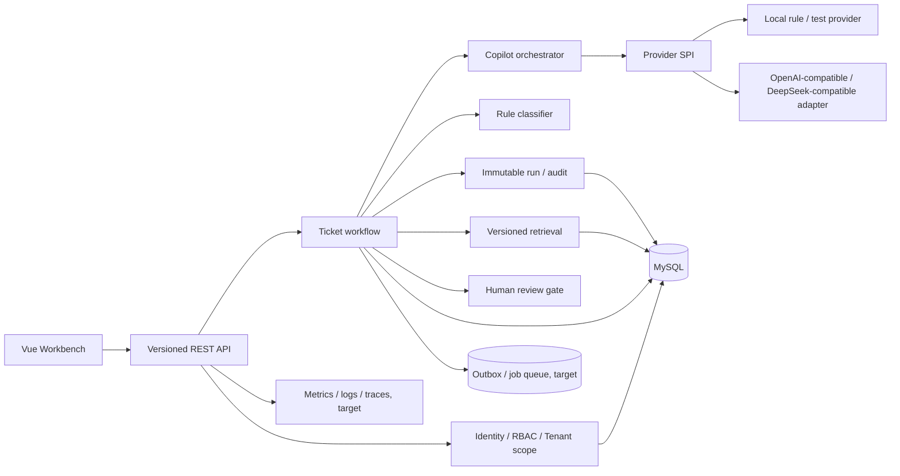

# Enterprise AI Ticket Copilot 后端下一阶段设计

> 状态：T0 API/状态合同、T1 第一条模块边界切片与 T2 工作流策略端口已实现，其余内容仍为设计稿。日期：2026-09-03。本文基于当前 Spring Boot、MyBatis-Plus、MySQL schema、前端真实 API 链路和本地测试结果，规划从 Showcase / 作品集演示版进入可控 staging 的后端演进。文中目标能力不能直接当作当前项目已经具备的生产能力。

## 0. 先说清楚：当前完成项与重构目标

### 当前已经完成

- 当前 Spring Boot 后端已经形成工单录入、规则分类、关键词检索、结构化 Copilot 输出、Citation membership 校验、安全拒答、人工复核和可回放 Trace 的本地闭环。
- `copilot_run`、`retrieval_hit`、`copilot_result`、`copilot_result_citation`、`review_record` 等不可变/追加式证据已经有 schema、实现和测试覆盖。
- Demo 与真实 API 前端边界、隔离 H2 真实 API smoke 和后端回归测试已经验证当前基线。
- T0 已冻结旧 `/api/...` 路由与状态合同；T1 已把 `TicketController` 改为依赖 `TicketWorkflowUseCase` 入站端口；T2 已把 `TicketWorkflowService` 的复核判断改为依赖 `ReviewPolicy`；当前回归为 94 条测试通过。
- 这些是当前实现的真实能力，不等于已经完成企业 IdP、租户隔离、真实 Provider、异步任务队列、向量检索或公网部署。

### 尚未完成

- GitHub 案例中的完整模块包迁移、Provider/检索/审计出站端口、真实安全边界和事务 Outbox 当前还没有全部落地；T1/T2 是两条可回归的边界切片，本文件把剩余能力定义为下一阶段实施任务。
- 因此，“后端测试通过”表示当前代码回归通过，不表示“GitHub 参考重构、真实模型接入和生产部署已经完成”。

## 1. 设计结论

当前项目已经形成一条有工程价值的链路：工单录入 → 规则分类 → 关键词知识匹配 → Copilot 结构化输出 → Citation membership 校验 → 不确定时 abstain → 人工复核 → append-only Trace / review history。下一阶段不再以“多加几个页面”为中心，而是把这条链路的身份、租户、版本、Provider 和运行可靠性做成可长期演进的后端边界。

核心决策：

1. 保留模块化单体作为第一阶段部署形态，不因为有 AI 就直接拆成微服务。
2. 保留当前 `/api/tickets` 兼容接口，新增版本化 `/api/v1` 契约；前端逐步迁移。
3. 将演示级 JWT/RBAC 替换为可轮换密钥、真实用户来源和资源级授权。
4. 将 local-rule、OpenAI-compatible、DeepSeek-compatible 等 Provider 放到同一个严格 SPI 后面；浏览器永远不直接调用 Provider。
5. 将知识库从当前关键词匹配演进为“可回放的版本化检索”，是否使用向量库必须经过同一评测集对比，不先把 Vector/RAG 写成结论。
6. 任何模型输出在进入状态流转、回复或知识发布前都要经过结构化解析、证据归属校验和人工门禁。

## 2. 当前事实基线

### 2.1 当前接口和能力

| 领域 | 当前事实 | 证据 / 接口 |
| --- | --- | --- |
| 健康 | `/api/health` 返回服务状态 | `HealthController` |
| 登录 | Demo 用户登录，返回 HMAC-SHA256 demo JWT；`/api/auth/me` 读取当前用户 | `AuthController`、`AuthService`、`AuthInterceptor` |
| 工单 | 列表、创建、详情、指标、状态分析、Trace evidence | `TicketController` 的 GET/POST |
| Copilot | 规则分类、关键词匹配、可选 OpenAI-compatible chat-completions、local-rule fallback | `TicketWorkflowService`、`AiProviderService` |
| 输出 | `copilot_run`、`retrieval_hit`、`copilot_result`、`copilot_result_citation` | Flyway V1/V2、`docs/structured-output-and-citation.md` |
| 复核 | Approve、Request changes、Reject；写入 review history | `POST /api/tickets/{id}/review/...` |
| 知识 | 关键词命中、知识草稿、人工确认发布 | `KnowledgeMatchingService`、knowledge API |
| 前端 | Demo 与 Real 明确分流；真实模式不会因 API 失败静默切回 fixture | `frontend/src/api/tickets.ts` |

### 2.2 当前不应声称

- 代码内 Demo 用户和默认 JWT signing key 不是生产身份系统。
- 当前知识匹配是关键词/规则匹配，不是已上线的 embedding、Vector DB、Hybrid 或 Rerank。
- 当前 `Trace` 是项目内可回放的运行证据链，不是 OpenTelemetry 分布式 Span 系统。
- 当前 Provider 的可选路径只支持特定 OpenAI-compatible `chat/completions` 响应形状；没有真实模型成功验收记录。
- 当前没有租户隔离、完整后台任务队列、通知、自动关闭工单、工具调用或无人值守 Agent。

### 2.3 GitHub 案例研究与本项目取舍

本次通过 GitHub/`gh` 调研了以下公开仓库。它们只用于提炼结构和工程方法，不复制第三方源码、品牌、截图或业务数据。

| GitHub 案例 | 可迁移做法 | 在 Ticket Copilot 的取舍 |
| --- | --- | --- |
| [spring-projects/spring-modulith](https://github.com/spring-projects/spring-modulith) | 以业务直系包表达模块；用 `ApplicationModules.verify()` 验证依赖；用 `@ApplicationModuleTest` 做模块集成测试；生成模块文档 | 先保留单体部署，按 `identity`、`ticket`、`knowledge`、`retrieval`、`copilot`、`provider`、`audit`、`ops` 做边界校验 |
| [xsreality/spring-modulith-with-ddd](https://github.com/xsreality/spring-modulith-with-ddd) | 从 DDD 领域模型演进到 Modulith、六边形架构和 OAuth2 安全；模块通过公开端口协作 | `ticket` 不直接依赖 Provider/检索实现；通过 `RetrievalPort`、`AiProviderPort` 和 `ReviewPolicy` 协作 |
| [sivaprasadreddy/spring-modular-monolith](https://github.com/sivaprasadreddy/spring-modular-monolith) | 按业务模块组织电商单体、倾向事件驱动、每个模块可独立测试 | 借鉴“按业务而不是按技术层”组织包；工单事件和通知可先走 Outbox，不立即拆 Kafka 微服务 |
| [spring-petclinic/spring-petclinic-modulith](https://github.com/spring-petclinic/spring-petclinic-modulith) | public API / internal 包分层；跨模块只发应用事件；事件发布登记保证至少一次；模块测试和文档自动化 | 对 `ticket`、`knowledge`、`audit` 只暴露 facade/event；历史 Trace 和 review 记录禁止被跨模块覆盖 |
| [lombocska/spring-boot-outbox-transactional-sample](https://github.com/lombocska/spring-boot-outbox-transactional-sample) | 主事务和待发布事件同库提交；消费端按至少一次语义重试和去重 | Copilot 完成、复核决策、知识发布等副作用进入 `outbox_event`；用 event id 和 job id 去重，Provider 仍在事务外 |

最终选择是“模块化单体 + DDD/六边形端口 + 不可变运行证据 + 事务 Outbox + Provider SPI”。这能把当前真实已有的审计链路继续保留，同时避免为了简历堆砌微服务、向量库和 Agent 编排。

### 2.4 对当前代码的具体重构映射

| 当前位置/能力 | 下一阶段重构动作 | 验收证据 |
| --- | --- | --- |
| `backend/src/main/java/...` 现有 Controller/Service/Mapper 混合结构 | 按业务模块重排 package；每个模块区分 `api`、`application`、`domain`、`infrastructure`/`internal` | `ApplicationModules.verify()`、模块依赖图、模块级集成测试 |
| `TicketWorkflowService` | 抽出 `TicketCommandPort`、`RetrievalPort`、`AiProviderPort`、`ReviewPolicy`，保留现有状态机和审计写入 | 工单状态迁移、越权、并发 review、Provider 错误映射测试 |
| `KnowledgeMatchingService` | 先封装关键词 baseline，再以同一评测集比较 BM25/embedding；不直接绑定向量数据库 | Recall@K、Citation coverage、abstention precision、可回放 snapshot |
| `copilot_run` / retrieval snapshot / review history | 保持 append-only；新增异步 job/outbox 时不得修改已完成 run | 历史知识变更后 Trace 仍能回放，重复 job 不重复生成记录 |
| Provider HTTP 客户端 | 放到 adapter，业务层只依赖 port；密钥、超时、重试、错误分类由配置和策略控制 | 401/429/5xx、超时、坏 JSON、越界 Citation、fallback 测试 |
| 现有 Demo Auth | 迁移至 Spring Security/OIDC 或真实用户存储，actor/tenant 显式传递给同步和异步流程 | 未登录、越权、过期 token、跨租户访问和审计测试 |

## 3. 目标模块和依赖方向



建议包结构按业务责任而不是按“AI / 页面”再拆一层：

| 模块 | 负责 | 明确不负责 |
| --- | --- | --- |
| `identity` | 用户、角色、租户、会话、权限 | 不在前端按钮上实现授权 |
| `ticket` | 工单生命周期、状态机、版本和归属 | 不直接访问 Provider |
| `knowledge` | 知识版本、发布状态、chunk 和来源 | 不在发布前绕过审核 |
| `retrieval` | 查询规范化、召回、排序、快照 | 不把召回结果自动当作事实 |
| `copilot` | 编排、超时、结构化解析、abstention、Review gate | 不执行外部业务动作 |
| `provider` | Provider 适配、错误分类、密钥引用 | 不持久化完整 prompt/secret |
| `audit` | run、retrieval snapshot、result/citation、review history | 不允许覆盖历史事实 |
| `ops` | 健康、指标、运行边界、脱敏诊断 | 不生成虚假质量 KPI |

## 4. API 演进

### 4.1 版本兼容

当前 `/api/...` 是 Showcase 契约。新增 `/api/v1/...` 时先保留旧接口，旧接口在 local profile 可继续使用；staging/production 必须通过配置明确关闭 Demo 兼容行为。

目标资源：

```text
POST /api/v1/auth/login
POST /api/v1/auth/refresh
POST /api/v1/auth/logout
GET  /api/v1/me

GET  /api/v1/tickets?status=&priority=&category=&cursor=
POST /api/v1/tickets
GET  /api/v1/tickets/{ticketId}
POST /api/v1/tickets/{ticketId}/copilot-runs
GET  /api/v1/tickets/{ticketId}/copilot-runs/{runId}
GET  /api/v1/tickets/{ticketId}/trace-evidence

POST /api/v1/tickets/{ticketId}/reviews
GET  /api/v1/tickets/{ticketId}/reviews
GET  /api/v1/knowledge/articles?query=&category=&status=
POST /api/v1/knowledge/articles/{articleNo}/publish
```

### 4.2 工单和运行命令

当前 `POST /{id}/run-copilot` 是同步命令。为了不让一次慢 Provider 请求占住 HTTP 线程，目标分两步：

- 第一阶段保持同步响应，增加 `Idempotency-Key`、超时上限和明确的 `runId`；适合 staging 验收。
- 第二阶段引入 `202 Accepted` + `runId` 查询，或 SSE/轮询状态；任务由 outbox/worker 执行，前端只订阅状态，不直接访问 Provider。

请求必须记录调用者、ticket 版本、knowledge snapshot version、requested provider/model/protocol。相同幂等键重放返回同一个 run；同键不同请求返回 `409`，不可重复产生 generation record 或 review 入口。

### 4.3 复核命令

推荐将三个兼容路径逐步收口为：

```json
POST /api/v1/tickets/{ticketId}/reviews
{
  "decision": "APPROVE|REQUEST_CHANGES|REJECT",
  "comment": "人工审核说明",
  "expectedVersion": 12
}
```

后端用 `expectedVersion` 防止两个审核人覆盖彼此的状态；决策、旧状态、新状态、reviewer、runId、comment、时间和客户端 correlation 必须 append-only 保存。`APPROVE` 只能在 review gate 允许时生效；`REQUEST_CHANGES` / `REJECT` 必须有原因。

## 5. 数据模型和可回放性

### 5.1 当前表继续保留

`support_ticket`、`knowledge_article`、`ticket_ai_analysis`、`generation_record`、`ticket_status_history`、`copilot_run`、`retrieval_hit`、`review_record`、`copilot_result`、`copilot_result_citation` 构成当前事实链。尤其不能用当前可变知识内容覆盖过去 run 的标题、摘要、分数、排序或 Citation 归属。

### 5.2 目标增量表

| 表 | 作用 | 设计要点 |
| --- | --- | --- |
| `tenant` | 租户边界 | 所有业务事实带 tenant_id，跨租户查询默认拒绝 |
| `app_user` / `user_identity` | 真实用户映射 | 外部 subject 唯一；不存明文密码（若由 IdP 管理则不存密码） |
| `role` / `permission` / `user_role` | RBAC | 资源动作和租户作用域可审计 |
| `knowledge_article_version` | 知识版本 | 发布、撤回、验证人、验证时间和来源版本 |
| `knowledge_chunk` | 检索单元 | chunk hash、版本、位置、文本边界、索引状态 |
| `retrieval_index_record` | 索引状态 | 可重建、可失败重试，不能改变已完成 run 的 snapshot |
| `copilot_job` | 异步执行 | 状态、attempt、lease、超时、幂等键和 owner |
| `outbox_event` | 事务后事件 | 与业务事务同库提交，消费幂等 |
| `security_audit_event` | 权限/配置审计 | actor、action、resource、result、correlation，禁止秘密 |

### 5.3 事务边界

- 创建工单和初始状态历史在一个事务完成。
- Copilot run 的开始记录、retrieval snapshot、generation/result/citation 和最终 run 状态必须有明确的事务边界；跨服务 Provider 不放进数据库事务，采用状态机 + 补偿/重试。
- Review 状态改变和 review_record 必须原子提交；状态机拒绝非法跳转。
- 知识发布只改变新版本的 published 状态，不修改历史 run 的 retrieval snapshot。
- 所有写模型提供版本号或唯一约束，避免重复 run、重复 Citation 和重复 review。

## 6. 检索和知识库路线

当前 `KnowledgeMatchingService` 是关键词评分。下一阶段按评测驱动推进：

1. 先把 article version/chunk/source metadata 做好，保持当前关键词 baseline 可回放。
2. 对同一 `data/eval/ticket_rag_eval_cases.jsonl` 增加 BM25 / full-text baseline，记录 Recall@K、Citation coverage、abstention precision 和人工复核率。
3. 只有 baseline 数据不足时，才评估 embedding store；先抽象 `RetrievalProvider`，不要让业务服务绑定某个向量数据库。
4. 若加入 hybrid/rerank，必须保存每个阶段的候选、分数、模型版本和耗时，便于解释“为什么引用了这条知识”。
5. 发布知识版本后再建立索引；索引未就绪时宁可返回无证据和人工复核，不返回未验证引用。

目标接口：

```text
RetrievalResult retrieve(
  tenantId,
  ticketSnapshot,
  knowledgeVersion,
  RetrievalPolicy policy
)
```

`RetrievalResult` 只允许返回有来源和版本的候选，不负责直接生成回答。Citation Validator 仍然只接受本次 run 的允许 ID，并将验证关系指向 retrieval snapshot。

## 7. Provider 适配和真实模型接入

### 7.1 Provider SPI

```text
AiProviderPort
  ├─ LocalRuleProvider             # 默认测试 / Showcase
  ├─ OpenAiCompatibleProvider      # chat-completions
  ├─ DeepSeekCompatibleProvider    # 若协议兼容则复用 HTTP adapter
  └─ OpenAiProvider                # 仅在明确协议/模型配置后启用
```

DeepSeek 和 OpenAI 的具体模型名、base URL、响应格式、余额/限流规则必须以对应环境的实际配置和一次隔离验收为准；“有 API Key”不等于“已经接入并通过业务验收”。Provider 名称、协议、模型、attempt、latency、错误类别和 fallback 结果写入安全摘要。

### 7.2 请求契约

发送给外部模型的上下文只包括：

- 脱敏后的工单标题/描述和必要分类；
- 当前 run 的知识检索快照（article ID、标题、受限片段、分数）；
- 严格的 JSON 输出契约和允许 Citation ID 列表。

禁止发送完整错误日志、访问令牌、数据库连接、Provider Key、内部网络信息和无关用户数据。ticket 字段作为不可信数据处理，必须抵抗 prompt injection；模型不能自行声明动作已执行。

### 7.3 输出门禁

```text
HTTP status
  -> JSON parse
  -> shape / length / enum validation
  -> citation membership validation
  -> abstention and risk policy
  -> persist result + immutable evidence
  -> human review gate
```

坏 JSON、缺字段、越界 Citation、模型拒答、Provider 401/403/429/5xx、超时或结果过长都要得到确定的系统状态。Fallback 只能是本地安全结果，不能把 fallback 标记成外部模型成功。

### 7.4 配置和密钥

建议配置：

```text
TICKET_AI_PROVIDER=local-rule|openai-compatible|deepseek
TICKET_AI_BASE_URL=https://...
TICKET_AI_MODEL=...
TICKET_AI_PROTOCOL=chat-completions
TICKET_AI_API_KEY=<secret-manager-reference>
TICKET_AI_CONNECT_TIMEOUT_MS=6000
TICKET_AI_READ_TIMEOUT_MS=18000
TICKET_AI_MAX_RETRIES=1
TICKET_AI_FALLBACK_TO_LOCAL=true
```

密钥只来自 secret manager 或部署环境，不进 Git、前端 bundle、日志、Trace、截图或异常响应。生产默认必须有超时、限流、熔断/舱壁、成本上限和人工降级开关；当前仓库的本地默认 key 和 local-rule 只服务 Demo/测试。

## 8. 身份、RBAC 和安全

建议最小权限：

| 角色 | 读权限 | 写权限 |
| --- | --- | --- |
| `REQUESTER` | 自己提交的工单和允许公开的状态 | 创建/补充自己的工单 |
| `AGENT` | 所属租户工单、知识、运行摘要 | 运行 Copilot、转派、补充处理信息 |
| `REVIEWER` | 待复核工单、Evidence、Trace | Approve / Request changes / Reject |
| `KNOWLEDGE_EDITOR` | 知识草稿和版本 | 编辑草稿，不能越过发布门禁 |
| `ADMIN` | 租户运营、策略和审计 | 配置和授权，所有动作审计 |
| `AUDITOR` | 只读运行和安全证据 | 无业务写权限 |

落地顺序：

1. 把 Demo 用户替换成 OIDC/企业 IdP 或强哈希密码的真实用户存储；JWT signing key 使用 secret manager、轮换和 `kid`。
2. 将 `AuthContext` 的 ThreadLocal 生命周期保留为短期兼容，但最终统一到 Spring Security `SecurityContext`，确保异步任务显式传递 actor/tenant，而不是依赖线程状态。
3. 每个查询和命令都执行 tenant + resource scope；不能只靠前端隐藏按钮。
4. 登录、Copilot、review、知识发布、Provider 配置和失败尝试写入安全审计；错误响应只给安全错误分类。
5. 配置 CORS/CSRF/HTTPS、请求体上限、速率限制、依赖漏洞扫描、备份和恢复演练。

## 9. 可部署环境

建议逻辑域名只是候选，不代表当前已解析：

```text
ticket.wzl8.top      -> Vue static assets / reverse proxy
ticket-api.wzl8.top  -> HTTPS reverse proxy -> Spring Boot
```

目标部署单元：

- Spring Boot API：非 root、健康/就绪探针、优雅停机、配置外置；
- MySQL：Flyway 迁移锁、备份、恢复验证、读写权限分离；
- Redis（可选）：限流/短任务状态，不存唯一业务事实；
- Provider boundary：只允许后端出站，超时和 egress allowlist；
- 日志/指标：结构化输出，按 tenant/user/run 关联但不暴露 PII/Key；
- 前端：API base URL 由环境注入，不能把 `127.0.0.1`、Demo token 或 Provider key 打包进去。

公网发布前先建 staging：使用合成数据，验证迁移、登录、RBAC、Provider 假响应、429/超时/fallback、备份恢复、回滚和监控。当前没有执行 DNS、云资源、真实 Provider 或公网部署。

## 10. 实施阶段和验收门槛

| 阶段 | 目标 | 必须有的证据 |
| --- | --- | --- |
| T0 契约冻结 | `/api/v1`、状态机、Review decision、run 幂等 | OpenAPI、契约测试、兼容说明 |
| T1 身份与租户 | 真实用户、tenant scope、RBAC、key rotation | 未登录/越权/跨租户/过期 token 测试 |
| T2 可回放知识 | article version/chunk、索引状态、baseline 评测 | 同一输入可重现 retrieval snapshot |
| T3 Provider 接入 | Mock + 外部兼容适配、超时、fallback、成本边界 | 隔离 staging 的成功/失败矩阵；Key 不入仓 |
| T4 异步和可靠性 | run job、outbox、重试、去重、并发 review | 重启/重复消息/重复 run 不破坏事实 |
| T5 可观测性 | correlation、指标、脱敏审计、告警 | 能区分 DB、检索、Provider、Review 各层耗时/失败 |
| T6 staging | Docker/迁移/备份/反向代理/前端环境 | staging 浏览器 smoke、回滚和恢复演练 |
| T7 受控发布 | 先内部访问，再公开链接 | 发布审批、监控窗口、回滚点和变更记录 |

## 11. 测试矩阵

- 单元：状态机、角色矩阵、分类、知识评分、Citation membership、Structured Output、abstention、Review gate、Provider error mapping。
- 集成：MySQL migration、Mapper、事务、异步 job、outbox、Redis（如启用）、并发 review 和重复 run。
- API：OpenAPI contract、认证、tenant scope、CORS/CSRF、安全错误、分页、幂等和版本兼容。
- Provider：Mock contract、成功 JSON、坏 JSON、缺字段、越界 Citation、401/403/429/5xx、超时、连接失败、空响应、超长响应和 fallback。
- 安全：prompt injection、日志脱敏、密钥不出现在 bundle/Trace、越权、重放 token、密钥轮换。
- 浏览器：真实 API 模式和 Demo 模式分别验收；运行建议 → Evidence → Trace → Review 的状态闭环，不以 Demo fixture 证明真实后端。
- 运维：健康/就绪、迁移回滚策略、备份恢复、容器资源限制、优雅停机和告警。

## 12. 现在可以写进简历的口径

在 T0～T2 尚未实现前，建议保持以下诚实表述：

> Spring Boot + MyBatis-Plus 企业工单辅助处理系统：实现规则分类、关键词知识匹配、结构化 Copilot 结果、Citation 归属校验、abstention、可回放运行证据和人工复核门禁；当前默认 local-rule，外部 Provider、生产身份、向量检索和公网部署为下一阶段规划。

完成 T3 之后，才可以补充“具备可配置的 OpenAI-compatible / DeepSeek-compatible Provider 适配和失败降级证据”；完成 T1/T6 之后，才可以补充生产式身份、staging 部署等描述。文档写入本身不会改变实现状态。
